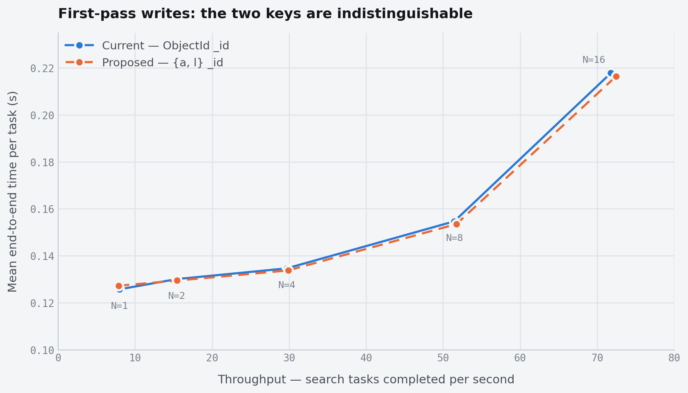

# MongoDB deduplication

> Author: Zhihao · [Original Notion page](https://app.notion.com/p/3c904e4d9e6b80d68854d02b96aaf267?pvs=204)

## 1. Problem
Search results in the results cache have no unique key. Each task writes its documents with a server-generated `ObjectId`, so nothing prevents the same logical result from being stored twice. If a task is re-executed — a retry after failure, or two replicas of one task running at once — every result it produces is inserted again as a new document.
We reproduced this directly. Searching 128 archives twice into one collection produced **640,000 documents where 320,000 were correct**: a 100% duplication rate, in every repetition.
Today the bug is latent rather than active. Celery's `task_acks_late` is unset, so a crashed task is lost rather than redelivered, and the scheduler fails the whole job when any task fails — there is no retry path to trigger it. But the failure is silent when it does occur: duplicates render in the UI, inflate `numTotalResults`, and nothing marks the collection as wrong. Any future retry capability turns this into a live correctness bug, and retry is the natural thing to add next.
One constraint shapes the fix. The key must be derived from *the data*, not from the execution. `archive_id` and `log_event_ix` are properties of the archive and are identical on every rerun; identifiers minted per dispatch are not, and would deduplicate nothing.
---
## 2. Conclusion
Give each result document a deterministic `_id` derived from `(archive_id, log_event_ix)`. MongoDB's mandatory `_id` index then enforces uniqueness for free, and a re-run task's inserts are rejected as duplicate keys instead of landing as new rows. No secondary index is added; the collection keeps exactly the two indexes it has today.
We measured this against the current behaviour on real `clp-s` searches — 128 archives of 1,000,000 JSON lines each, 2,500 results per archive, driven by a Rust harness forking `clp-s` from a pool of real OS threads, at concurrency 1 through 16, five repetitions per cell.
**On the normal search path the cost is not measurable.** Across all five concurrency levels the change moves total wall-clock time by between −0.9% and +1.2%, and the per-repetition ranges of the two configurations overlap at every single point. The scaling curves are indistinguishable: both reach \~56% of ideal throughput at N=16, and they degrade together, so the ceiling is the shared Mongo write path rather than anything about the key.
The honest limit on that claim: two independent sweeps of the identical matrix differ by up to **6.2%** on the same cell. Run-to-run drift is roughly five times larger than the largest effect we are trying to resolve. We can therefore state that the change costs nothing detectable at this resolution — not that it is exactly free.
**This measurement covers the first pass only.** The rerun path costs materially more; see §3.4.
---
## 3. Implementation
### 3.1 The change
Set `_id` to a BSON subdocument:
```javascript
_id = { a: <archive_id>, l: <log_event_ix> }
```
Uniqueness comes from the `_id` index that every collection already has. Inserts use `ordered: false` and treat duplicate-key errors (11000) as success, so a rerun converges to the correct document set rather than failing.
```c++
// clp_s::ResultsCacheOutputHandler::finish()
auto id = make_document(kvp("a", archive_id), kvp("l", log_event_ix));
// ordered(false): keep inserting past a duplicate; 11000 is not a failure
collection.insert_many(results, insert{}.ordered(false));
```
### 3.2 Why a subdocument rather than a concatenated string
MongoDB compares subdocument keys field by field, in declaration order, so `{a, l}` sorts and indexes exactly like a compound key while keeping `log_event_ix` a native integer. A concatenated string would sort lexicographically — `"1000"` before `"999"` — scattering each archive's inserts instead of appending them in order.
One hazard to enforce: subdocument comparison **is** order-sensitive. `{a, l}` and `{l, a}` are different keys. Every writer must emit the fields in one fixed order, from one code path.
### 3.3 Scalability against the current behaviour
Both configurations carry only the `{timestamp:-1, _id:1}` index; neither adds a secondary index. Median of 5 repetitions, 128 archives per run.

*Latency against throughput as the pool grows from 1 to 16 concurrent search tasks. The curves are near-coincident at every point — that coincidence is the result, not a plotting error. The upward bend past N=8 is saturation of the shared Mongo write path, present identically in both. The y-axis starts at 0.10 s rather than zero, which visually widens the gap between the two curves; at a zero baseline they would overlap almost exactly.*
<table header-row="true">
<tr>
<td>N</td>
<td>Current (ObjectId)</td>
<td>`{a, l}`</td>
<td>Δ</td>
<td>Throughput (tasks/s)</td>
<td>Mean e2e (s)</td>
<td>Scaling eff.</td>
</tr>
<tr>
<td>1</td>
<td>16.087 s</td>
<td>16.285 s</td>
<td>+1.2%</td>
<td>7.96 → 7.86</td>
<td>0.1257 → 0.1272</td>
<td>100%</td>
</tr>
<tr>
<td>2</td>
<td>8.326 s</td>
<td>8.284 s</td>
<td>−0.5%</td>
<td>15.37 → 15.45</td>
<td>0.1300 → 0.1294</td>
<td>96.6%</td>
</tr>
<tr>
<td>4</td>
<td>4.309 s</td>
<td>4.282 s</td>
<td>−0.6%</td>
<td>29.70 → 29.89</td>
<td>0.1346 → 0.1337</td>
<td>93.3%</td>
</tr>
<tr>
<td>8</td>
<td>2.488 s</td>
<td>2.474 s</td>
<td>−0.6%</td>
<td>51.45 → 51.74</td>
<td>0.1547 → 0.1535</td>
<td>80.8%</td>
</tr>
<tr>
<td>16</td>
<td>1.783 s</td>
<td>1.767 s</td>
<td>−0.9%</td>
<td>71.78 → 72.46</td>
<td>0.2178 → 0.2164</td>
<td>56.4%</td>
</tr>
</table>
Per-repetition ranges overlap at all five points:
<table header-row="true">
<tr>
<td>N</td>
<td>Current (min–max)</td>
<td>`{a, l}` (min–max)</td>
<td>Overlap</td>
</tr>
<tr>
<td>1</td>
<td>15.481 – 16.343</td>
<td>16.047 – 16.548</td>
<td>yes</td>
</tr>
<tr>
<td>2</td>
<td>8.148 – 8.368</td>
<td>8.188 – 8.335</td>
<td>yes</td>
</tr>
<tr>
<td>4</td>
<td>4.231 – 4.434</td>
<td>4.261 – 4.399</td>
<td>yes</td>
</tr>
<tr>
<td>8</td>
<td>2.472 – 2.508</td>
<td>2.417 – 2.485</td>
<td>yes</td>
</tr>
<tr>
<td>16</td>
<td>1.711 – 2.000</td>
<td>1.757 – 1.791</td>
<td>yes</td>
</tr>
</table>
Every Δ sits inside the 6.2% run-to-run drift measured between two independent sweeps. Scaling efficiency is throughput at N relative to N × (throughput at N=1); it is the same in both configurations to within a percentage point.
### 3.4 Scope of the measurement — read before citing §2
**The sweep above measures the first pass only.** Every timed run wrote 128 distinct archives, once each, into a freshly-dropped collection: all 11,520 timed task records report `num_dup = 0`. No timed run ever encountered a duplicate key.
Two cases are therefore **not** covered by that curve:
- **The rerun path** — writing into an already-populated collection, where every insert is rejected as a duplicate. This is the path the change exists to make safe.
- **Concurrent duplicate execution** — two replicas of the same archive in flight simultaneously, which is what a retry actually produces.
Duplicate rejection is not cheap: with `ordered: false`, MongoDB attempts all 2,500 inserts and returns a reply carrying 2,500 `writeErrors` entries to build, serialize and parse. Indicative figures from an earlier Python-harness run (weaker evidence; its concurrent-replica and single-archive cells carry a checkpoint-bleed caveat):
<table header-row="true">
<tr>
<td>Scenario</td>
<td>First pass</td>
<td>Rerun</td>
</tr>
<tr>
<td>128 archives, 16-way</td>
<td>+0.2%</td>
<td>+26.8%</td>
</tr>
<tr>
<td>Single archive</td>
<td>+1.3%</td>
<td>+56.7%</td>
</tr>
<tr>
<td>Concurrent replicas</td>
<td>+34.3%</td>
<td>+49.5%</td>
</tr>
</table>
This cost is paid only when a task actually re-executes, and the alternative is silently doubling the result set. But it should be measured properly on the Rust harness before this proposal is treated as settled.
### 3.5 Partial-batch failure and recovery
A task writes its 2,500 results in three batches (1,000 + 1,000 + 500). If it dies part-way through the second batch — say 400 of that batch's 1,000 documents were applied — the collection is left holding 1,400 of 2,500. **Does a rerun complete the remaining 1,100, and what does the driver report?**
**Yes, it converges — but only because the insert is unordered.** With `ordered: false`, MongoDB attempts *every* document in the batch, rejecting the duplicates individually and inserting the rest. Measured directly against MongoDB 8.0.21:
<table header-row="true">
<tr>
<td>Insert mode</td>
<td>Inserted</td>
<td>Write errors</td>
<td>Final count</td>
<td>Outcome</td>
</tr>
<tr>
<td>`ordered: false`</td>
<td>600</td>
<td>400 (all 11000)</td>
<td>1,000</td>
<td>converged</td>
</tr>
<tr>
<td>`ordered: true`</td>
<td>0</td>
<td>1</td>
<td>400</td>
<td>stuck</td>
</tr>
</table>
The second row is the important one. `ordered: true` is the **driver default and today's behaviour**: it aborts at the first error and skips every remaining document. A rerun after a partial-batch failure would therefore insert *nothing* and leave the collection permanently short — and so would every subsequent rerun, because each one aborts on the same first duplicate. That is arguably worse than the duplication bug: silently truncated results rather than inflated ones.
**An unordered insert is therefore a correctness requirement of this design, not a performance tuning choice.**
End-to-end with the patched `clp-s`, pre-loading a collection with 1,400 of an archive's 2,500 results and re-running the identical task:
```javascript
CLP_BENCH_TIMING write_phase_us=208785 num_docs=2500 num_dup=1400 num_batches=3
exit code: 0     final count: 2500     identical to a clean run: true
```
**How the errors surface.** The server returns a normal write reply, and the driver raises `mongocxx::bulk_write_exception` because the reply carries write errors. The reply contains:
- `nInserted` — how many documents were actually stored (600 above);
- `writeErrors` — one entry per rejected document, each with its `index` in the batch and `code` `11000`.
So **the exception does not mean the operation failed.** The handler must inspect the codes rather than treating any throw as an error:
```c++
catch (mongocxx::bulk_write_exception const& e) {
    // Success iff every write error is a duplicate key; anything else is real.
    auto const duplicates = count_duplicate_key_write_errors(e);
    if (!duplicates) { return ErrorCode::ErrorCodeFailureDbBulkWrite; }
    num_dup += *duplicates;
}
```
An absent or malformed reply, an empty `writeErrors` array, or any code other than 11000 is still a genuine failure — a `bulk_write_exception` with no write errors is a different error class (a write-concern error, for instance) and must not be swallowed.
**Why convergence is guaranteed rather than merely likely.** The handler drains its result heap in ascending timestamp order, so a crash always leaves a **prefix** of the final result set, never an arbitrary subset. Because a `clp-s` search is deterministic — single-threaded, with a deterministic schema iteration order — the rerun produces exactly the same 2,500 documents in the same order. The partial set is therefore always a subset of what the rerun writes, so every missing document is inserted and no stale document is ever orphaned. `num_dup` reports how much of the previous attempt survived (1,400 above), which makes the recovery observable rather than silent.
### 3.6 Correctness, measured
Running all 128 archives twice into one collection, with only the timestamp index present:
<table header-row="true">
<tr>
<td></td>
<td>After pass 1</td>
<td>After pass 2</td>
<td>Rejected</td>
</tr>
<tr>
<td>Current</td>
<td>320,000</td>
<td>640,000</td>
<td>0</td>
</tr>
<tr>
<td>`{a, l}`</td>
<td>320,000</td>
<td>320,000</td>
<td>320,000</td>
</tr>
</table>
### 3.7 What else has to change
1. **The garbage collector.** `_get_latest_doc_timestamp` infers a collection's age from the timestamp embedded in the newest `ObjectId`, and raises on any other `_id` type. It needs a different age signal — a `created_at` field, or the job's finish time from `results-metadata`.
2. **The web UI.** `useSearchResults` unwraps `_id` from the `{"$oid": …}` form; it must accept the subdocument.
3. **Index cost.** Total index size at 320,000 documents grows from 7.23 MB to 8.89 MB (+23%), because the key is wider than a 12-byte `ObjectId`. Collection storage is unchanged or slightly smaller.
4. **Aggregation results are unaffected.** They are written by `ResultsCacheSink`, keep their `ObjectId`, and cannot collide.
---
## Measurement environment
Intel i9-14900K, 16 physical cores / 32 logical, 47 GiB RAM, Linux 6.6.87.2 (WSL2). MongoDB 8.0.21, standalone, WiredTiger, `w:1`, on the same host as the search processes.
Production runs a single-node replica set, whose oplog makes writes more expensive than measured here; results per archive were fixed at 2,500 against a production default of 1,000. Both push the write path's share of a search **up**, so this is a conservative setting in which to claim no regression on the first pass.
Harness: standalone Rust crate, 2,135 lines, `std::thread::scope` pool over an `mpsc` queue; `clippy -D warnings` and `fmt --check` clean; 14 unit tests. MongoDB control plane via `mongosh`, no driver in the measured path.

