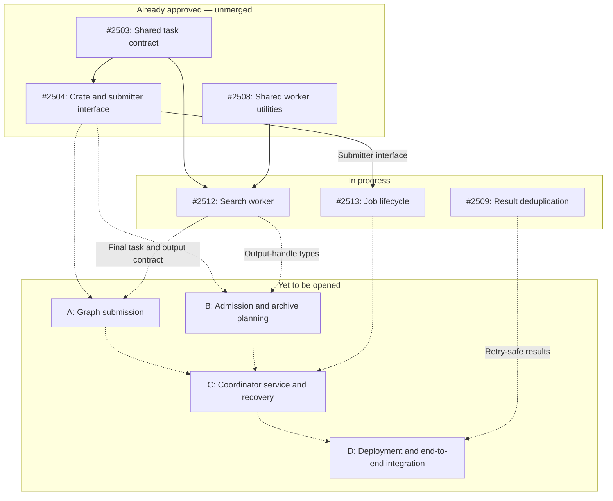

# Query coordinator implementation roadmap

- [MVP design](query-mvp-design.md) — plain-search behavior.
- [MVP+1: cancellation](query-mvp-plus-1-cancellation.md) — changes after MVP.
- [MVP+2: timeline aggregation](query-mvp-plus-2-aggregation.md) — changes after MVP+1.

This roadmap distinguishes approved work, opened work still in progress, and PRs yet to be opened.
Review states and dependency hints were checked on 2026-09-08. All six existing PRs are unmerged.
Stacked diffs include prerequisite changes and must not be counted as independent delivery.

## MVP

### Already approved

Approval means a recorded human approval, not that a PR is merged or necessarily merge-ready.
Release timing, prerequisite merges, and repository checks remain separate requirements.

| PR | What it delivers | Dependencies | Review / merge notes |
| --- | --- | --- | --- |
| [#2503](https://github.com/y-scope/clp/pull/2503) | Shared query-task signatures and I/O types; task execution remains a placeholder. | No prerequisite PR declared. | [Approved by Zhihao](https://github.com/y-scope/clp/pull/2503#pullrequestreview-5080765967); approval requests merging after v0.14.0. |
| [#2504](https://github.com/y-scope/clp/pull/2504) | Coordinator crate and submitter interface; graph submission remains a placeholder. | #2503, explicitly stated in the PR body. | [Approved by Zhihao](https://github.com/y-scope/clp/pull/2504#pullrequestreview-5105233872); merge after #2503. |
| [#2508](https://github.com/y-scope/clp/pull/2508) | Shared worker utilities for binary paths and S3 credentials. | No prerequisite PR declared. | [Approved by Bingran](https://github.com/y-scope/clp/pull/2508#pullrequestreview-5079383951). |

### In progress

| PR | What it delivers | Dependencies | Review / merge notes |
| --- | --- | --- | --- |
| [#2509](https://github.com/y-scope/clp/pull/2509) | Result deduplication, result-consumer updates, and result-cache garbage collection changes. | No prerequisite PR declared; needed for the integrated retry-safe MVP. | Changes requested; a later comment approves the web UI portion, not the full PR. |
| [#2512](https://github.com/y-scope/clp/pull/2512) | Registered archive-search worker, output-handle variants, and clp-s execution. | #2503 and #2508, explicitly stated in the PR body. | Awaiting review; no submitted reviews at the snapshot. Does not construct Spider graphs. |
| [#2513](https://github.com/y-scope/clp/pull/2513) | Job lifecycle, SQL persistence, and Spider start/poll/recovery support. | #2504's submitter interface; inferred from the implementation, not explicitly numbered in the body. | Draft, with changes requested. Graph construction is explicitly deferred. |

### Remaining work

#2513's handler/RFC reconciliation is complete. The four #TBD entries require new PRs; A–D match the
dependency diagram below. Each item's checklist appears once beneath this table.

| PR | Work item | Delivery |
| --- | --- | --- |
| #TBD | A — Graph submission | New PR |
| #TBD | B — Admission and archive planning | New PR |
| #TBD | C — Coordinator service and recovery | New PR |
| #TBD | D — Deployment and end-to-end integration | New PR |

#### A — Graph submission

Replace the submitter placeholder with one `query::clp_s_search` node per prepared archive.

- Serialize the exact task argument order and wire representation from the TDL RFC.
- Attach each archive's execution policy and the appropriate resource group.
- Register without starting; the handler persists the Spider ID before execution starts.
- Do not add a join, query commit, or termination task.
- Keep registration ambiguity visible; do not automatically register replacement graphs after
  uncertain responses.

This work consumes the shared/worker contract and submitter interface. It is distinct from #2512.

#### B — Admission and archive planning

[Coordinator planning](query-coordinator-planning-design.md) defines the target boundary.

- Read and decode query configuration; categorize supported jobs before claiming them.
- Validate inputs and prepare dataset/archive pairs using time and retention filters.
- Resolve the persisted result-limit compatibility contract.
- Prepare job-wide options, result destination, collection/index setup, and per-archive policies.
- Complete valid zero-archive queries directly in MySQL.
- Define exclusive ownership with the legacy scheduler.

Graph construction and preparation can be developed against their shared interface, then integrated.

#### C — Coordinator service and recovery

Integrate configuration, database credentials, resource-group setup, admission/polling, concurrency,
handler spawning, and binary startup/shutdown.

- Discover running rows with durable Spider IDs and reattach without rebuilding graphs.
- Include recovered jobs in concurrency accounting and track handles during shutdown.
- Preserve running state after observation or terminal-persistence failures.
- Add an existing-database migration or explicitly limit initial deployment to fresh databases.
  Editing `CREATE TABLE IF NOT EXISTS` alone does not upgrade an existing table.
- Keep reconstructible local phases out of the durable schema.

Prototype code in the archived roadmap is reference material, not proof these pieces are integrated
into the six opened PRs.

#### D — Deployment and end-to-end integration

Exercise successful search, no selected archives, no log matches, invalid configuration, unsupported
categories, retry/deduplication, partial failure, lost SQL transitions, and restart at registration,
persistence, and completion boundaries. Verify result limits and output URI handling end to end.

Complete package/Compose/Helm integration, binary and TDL-library loading, archive mounts or S3
access, worker credentials, readiness, and graceful shutdown. Use one effective coordinator owner
and prevent overlap with the legacy scheduler during cutover. Verify that task hard timeouts do not
leave native child processes running.

These are delivery acceptance checks, not checks performed by this documentation update.

### PR dependency DAG

Arrows point from prerequisite to dependent. Solid arrows are verified existing-PR dependencies;
dashed arrows are proposed dependencies for unopened PRs. These are integration prerequisites, not
a requirement to wait before developing against the shared interfaces.

#2504's body names #2503. #2512's body names #2503 and #2508. The #2504-to-#2513 edge follows the
submitter interface used by the lifecycle implementation; #2513's body does not explicitly list it.

#2509 is not a declared prerequisite of #2512. It is shown as an integration requirement for
retry-safe results, rather than inventing a worker-PR dependency absent from the PR body.

## MVP+1: cancellation

Depends on a working MVP and the cancellation delta design.

1. Settle pending/running/terminal cancellation races and durable request ownership.
2. Implement cancellation discovery and Spider cancellation requests.
3. Extend handler outcome persistence and restart recovery for requested cancellation.
4. Verify native-process termination and partial-result presentation.
5. Append MVP+1 changes to affected component designs; record "no change" for unaffected components.

No PR number is assigned here until the corresponding implementation is opened.

## MVP+2: timeline aggregation

Depends on MVP+1 and a settled timeline contract.

1. Specify bucket identity, retry-safe writes, result schema, and MongoDB reduction.
2. Extend worker/shared types and coordinator preparation for timeline queries.
3. Implement reduction orchestration, completion criteria, and cancellation behavior.
4. Update producer/web UI integration and define the paired-job cutover.
5. Verify multi-archive reduction, retries, failures, recovery, and cancellation.
6. Append MVP+2 component changes relative to MVP+1, or "no change".

Other aggregations and decompression are not implied by this milestone.

## Historical plans

[Previous implementation roadmap](archive/query-coordinator-pr-plan.md) preserves prototype coverage,
earlier PR splits, and deployment notes. It is not the current implementation checklist.
