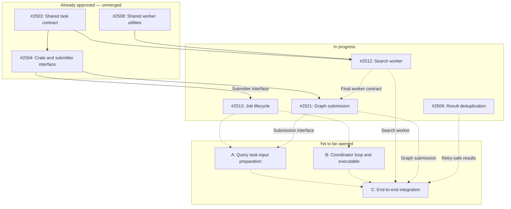

# Query coordinator implementation roadmap

- [MVP design](query-mvp-design.md) — plain-search behavior.
- [MVP+1: cancellation](query-mvp-plus-1-cancellation.md) — changes after MVP.
- [MVP+2: timeline aggregation](query-mvp-plus-2-aggregation.md) — changes after MVP+1.

This roadmap distinguishes approved work, opened work still in progress, and PRs yet to be opened.
Review states and dependency hints were checked on 2026-09-12. All seven existing PRs are unmerged.
Stacked diffs include prerequisite changes and must not be counted as independent delivery.

## MVP

### Already approved

Approval means a recorded human approval, not that a PR is merged or necessarily merge-ready.
Release timing, prerequisite merges, and repository checks remain separate requirements.

| PR | What it delivers | Dependencies | Review / merge notes |
| --- | --- | --- | --- |
| [#2503](https://github.com/y-scope/clp/pull/2503) | Shared query-task signatures and I/O types; task execution remains a placeholder. | No prerequisite PR declared. | [Approved by Zhihao](https://github.com/y-scope/clp/pull/2503#pullrequestreview-5080765967); approval requests merging after v0.14.0. |
| [#2504](https://github.com/y-scope/clp/pull/2504) | Coordinator crate and submitter interface; graph submission remains a placeholder. | #2503, explicitly stated in the PR body. | [Approved by Zhihao](https://github.com/y-scope/clp/pull/2504#pullrequestreview-5105233872); merge after #2503. |
| [#2508](https://github.com/y-scope/clp/pull/2508) | Shared worker utilities for binary paths and S3 credentials. | No prerequisite PR declared. | [Approved by Bingran](https://github.com/y-scope/clp/pull/2508#pullrequestreview-5079383951). |

### In progress

| PR | What it delivers | Dependencies | Review / merge notes |
| --- | --- | --- | --- |
| [#2509](https://github.com/y-scope/clp/pull/2509) | Result deduplication, result-consumer updates, and result-cache garbage collection changes. | No prerequisite PR declared; needed for the integrated retry-safe MVP. | Changes requested; a later comment approves the web UI portion, not the full PR. |
| [#2512](https://github.com/y-scope/clp/pull/2512) | Registered archive-search worker, output-handle variants, and clp-s execution. | #2503 and #2508, explicitly stated in the PR body. | Changes requested; review discussion is ongoing. Does not construct Spider graphs. |
| [#2513](https://github.com/y-scope/clp/pull/2513) | Job lifecycle, SQL persistence, and Spider start/poll/recovery support. | #2504's submitter interface; inferred from the implementation, not explicitly numbered in the body. | Draft, with changes requested. Graph construction is explicitly deferred. |
| [#2521](https://github.com/y-scope/clp/pull/2521) | Spider graph submission with one independent archive-search task per selected archive. | #2504, explicitly stated in the PR body; integrates with #2512's final worker contract. | Formal PR with changes requested. Lifecycle management remains in #2513. |

### Remaining work

The three #TBD entries require new PRs; A–C match the dependency diagram below. Each item's
checklist appears once beneath this table.

| PR | Work item | Delivery |
| --- | --- | --- |
| #TBD | A — Query task-input preparation | New PR |
| #TBD | B — Coordinator loop and executable | New PR |
| #TBD | C — End-to-end integration | New PR |

#### A — Query task-input preparation

[Coordinator planning](query-coordinator-planning-design.md) defines the selection behavior and
configuration inputs. Implement that preparation inside `QueryJobHandle::prepare_task_inputs()`.

- Use the SQL-row configuration passed into the handle to derive job-wide query options.
- Validate inputs and select dataset/archive pairs using time and retention filters.
- Resolve the persisted result-limit compatibility contract.
- Prepare the result destination, collection/index setup, archive metadata, and per-archive policies.
- Complete valid zero-archive queries successfully inside the handle without registering a Spider
  graph.
- Submit nonempty prepared inputs through #2521's submitter interface.

This work depends on #2513 and integrates with #2521. It does not construct task descriptors or
serialize task inputs.

#### B — Coordinator loop and executable

Add the query equivalent of the compression coordinator's `coordination.rs` and executable. Integrate
configuration, database credentials, resource-group setup, admission polling, concurrency, handler
spawning, and startup/shutdown.

- Read pending query rows, decode their configurations, categorize supported jobs, and construct
  handles without claiming unsupported job types.
- Discover running rows with durable Spider IDs and reattach without rebuilding graphs.
- Include recovered jobs in concurrency accounting and track handles during shutdown.
- Preserve running state after observation or terminal-persistence failures.
- Define exclusive ownership with the legacy scheduler.
- Add an existing-database migration or explicitly limit initial deployment to fresh databases.
  Editing `CREATE TABLE IF NOT EXISTS` alone does not upgrade an existing table.
- Keep reconstructible local phases out of the durable schema.

This work depends on #2513 and can proceed in parallel with task-input preparation. Prototype code
in the archived roadmap is reference material, not proof these pieces are integrated into the seven
opened PRs.

#### C — End-to-end integration

Exercise successful search, no selected archives, no log matches, invalid configuration, unsupported
categories, retry/deduplication, partial failure, lost SQL transitions, and restart at registration,
persistence, and completion boundaries. Verify result limits and output URI handling end to end.

Complete package/Compose/Helm integration, binary and TDL-library loading, archive mounts or S3
access, worker credentials, readiness, and graceful shutdown. Use one effective coordinator owner
and prevent overlap with the legacy scheduler during cutover. Verify that task hard timeouts do not
leave native child processes running.

These are delivery acceptance checks, not checks performed by this documentation update.

### PR dependency DAG

Arrows point from prerequisite to dependent. Solid arrows are verified existing-PR dependencies;
dashed arrows are proposed dependencies for unopened PRs. These are integration prerequisites, not
a requirement to wait before developing against the shared interfaces.

#2504's body names #2503. #2512's body names #2503 and #2508. The #2504-to-#2513 edge follows the
submitter interface used by the lifecycle implementation; #2513's body does not explicitly list it.

#2512 is not a declared prerequisite of #2521 because #2521 is based on #2504, but its final task
and output contract is required for integration. #2509 is likewise shown only as an end-to-end
requirement for retry-safe results.

## MVP+1: cancellation

Depends on a working MVP and the cancellation delta design.

1. Settle pending/running/terminal cancellation races and durable request ownership.
2. Implement cancellation discovery and Spider cancellation requests.
3. Extend handler outcome persistence and restart recovery for requested cancellation.
4. Verify native-process termination and partial-result presentation.
5. Append MVP+1 changes to affected component designs; record "no change" for unaffected components.

No PR number is assigned here until the corresponding implementation is opened.

## MVP+2: timeline aggregation

Depends on MVP+1 and a settled timeline contract.

1. Specify bucket identity, retry-safe writes, result schema, and MongoDB reduction.
2. Extend worker/shared types and coordinator preparation for timeline queries.
3. Implement reduction orchestration, completion criteria, and cancellation behavior.
4. Update producer/web UI integration and define the paired-job cutover.
5. Verify multi-archive reduction, retries, failures, recovery, and cancellation.
6. Append MVP+2 component changes relative to MVP+1, or "no change".

Other aggregations and decompression are not implied by this milestone.

## Historical plans

[Previous implementation roadmap](archive/query-coordinator-pr-plan.md) preserves prototype coverage,
earlier PR splits, and deployment notes. It is not the current implementation checklist.
