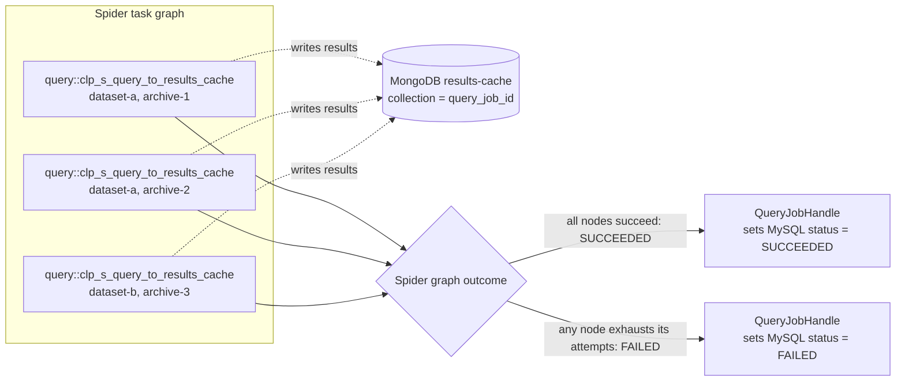

# RFC: MVP Spider TDL package for CLP-S queries

This RFC defines the normative Spider query TDL contract. Its primary outcome
is the final field list for each query task input and output, including every
field's Rust type, producer, validation and defaulting rules, exact use inside
the task, and consumer. The contract is forward-looking and must be complete
enough to implement the TDL functions without inferring behavior from the
Python implementation.

## MVP scope summary

The MVP covers only plain CLP-S queries using the results-cache output path:

- **CLP-S only.** The MVP supports archives produced by the CLP-S storage
  engine and invokes `clp-s` to query them. The legacy CLP storage engine,
  `clo`, and all other storage engines are outside the MVP scope.
- **Result-cache only.** clp-s writes query results directly
  to MongoDB through its `results-cache` output handler. The `network` and
  `file` output handlers are outside the MVP scope.
- **No aggregation.** The MVP does not support a reducer or any
  count/count-by-time/min/max/unique aggregation. An accepted query job has no
  aggregation configuration.
- **No cancellation.** The MVP does not consume `CANCELLING` query-job rows,
  request Spider cancellation, or define cancellation behavior for an active
  query task. `CANCELLED` is reserved for a future phase that adds explicit
  cancellation support. `KILLED` is removed from the query-job status model.

## 1. Context and background

The proposed query architecture separates job-level orchestration from
archive-level execution:

- The query coordinator discovers and categorizes query jobs and plans
  their archive work. It creates a per-job handle with that prepared plan.
- Spider owns distributed scheduling and execution of the submitted task graph.
- The CLP TDL package supplies the query functions that Spider workers can
  execute.
- clp-s writes results directly to the per-job results-cache collection.
- After Spider reports that every archive task succeeded, the query job handler
  marks the query job `SUCCEEDED` in MySQL. There is no query commit task.

### 1.1 Component responsibilities

#### 1.1.1 `QueryCoordinator`

The coordinator owns concerns spanning all query jobs:

- Poll and categorize MySQL query-job rows.
- Select the target archives and build a `QueryPlan`.
- Enforce the global concurrency limit.
- Create a `QueryJobHandle` containing the query job and its prepared plan.
- Provide coordinator-level recovery and fault tolerance.

#### 1.1.2 `QueryJobHandle`

One handle owns the durable lifecycle of one query job:

- Hold the coordinator-prepared `QueryPlan` through submission.
- Ask `QueryJobSubmitter` to submit the graph definition to Spider.
- Persist `spider_id` and `RUNNING` after Spider accepts it.
- Ask the submitter to start and poll the Spider job.
- Ensure that the MySQL query-job row reaches a terminal status after Spider
  reaches a terminal state. For the MVP, mark it `SUCCEEDED` and record its
  completed duration when the graph succeeds; mark it `FAILED` with the error
  when the graph fails or is unexpectedly cancelled. `CANCELLED` is reserved
  for future explicit cancellation support.

The handle does not select archives and does not construct Spider's graph
representation.

#### 1.1.3 `QueryJobSubmitter` trait and its `SpiderClient` implementation

`QueryJobSubmitter` is a trait owned by the query coordinator. It defines the
job-submission and terminal-outcome operations that `QueryJobHandle` needs
without making the handle construct Spider task descriptors or call the full
Spider API.

`SpiderClient` already exposes the generic Spider client API. It does not
require or know about `QueryJobSubmitter`. Instead, the query coordinator
implements its local `QueryJobSubmitter` trait for `SpiderClient`, adapting
that generic API into the query-specific operations required by
`QueryJobHandle`:

- `submit_query_job` translates `QueryPlan` into a `TaskGraph`, declares the
  TDL function names and I/O descriptors, serializes the task inputs, and calls
  `SpiderClient::submit_job`.
- `run_query_job_to_completion` starts the Spider job when necessary, polls it
  through `SpiderClient`, and translates its terminal state and error into
  `QueryJobOutcome`.

This implementation is coordinator-side integration code, not a second client
or a worker-side dependency. It references the TDL wire contract but does not
directly invoke the Rust TDL functions. The TDL package neither imports nor
uses `SpiderClient`; its task functions run later on workers selected by
Spider.

#### 1.1.4 Spider

Spider owns distributed graph execution:

- Schedule graph nodes on available workers.
- Run one `query::clp_s_query_to_results_cache` task for each planned
  archive.
- Apply each node's retry, concurrency, and timeout policy.
- Expose the Spider job's state and error to the submitter.

#### 1.1.5 CLP TDL package

The TDL package defines how each graph node executes:

- `query::clp_s_query_to_results_cache` interprets one CLP-S
  dataset/archive input and launches clp-s.
- clp-s writes matches directly to MongoDB collection
  `<query_job_id>`; the archive task returns archive identity as its graph
  output and reports execution success or failure to Spider.

The package does not select archives, construct the job-specific graph, or
return query results to the coordinator. It does not update the MySQL
`query_jobs` row.

### 1.2 New-job planning and lifecycle

For a new job, the coordinator owns planning and the handle owns the resulting
job lifecycle:

```text
PENDING query_jobs row
  -> QueryCoordinator creates QueryPlan
  -> QueryJobHandle asks the submitter to submit the graph to Spider
  -> QueryJobHandle persists spider_id and RUNNING
  -> QueryJobHandle starts and polls the Spider job
  -> Spider reports a terminal graph outcome
  -> QueryJobHandle marks the MySQL query job SUCCEEDED or FAILED
```

## 2. Purpose of this RFC

This RFC defines the Spider task interface required by the MVP query flow. It
will determine the required tasks and specify each task's signature, including
the complete set of input and output fields. For every input, it will describe
who produces it and exactly how it is used when constructing or executing the
Spider task graph.

For every output, the RFC will describe how it is produced and where it goes:
whether it remains internal to the task graph, is consumed by another task, is
uploaded to persistent storage, or is represented in the final Spider job
outcome. It will also state how each output or persistent side effect is used
by `QueryJobHandle` and `QueryCoordinator`. The resulting specification must
make the complete data flow traceable without assuming the number or names of
the tasks before the design is complete. Once the RFC is complete, an
implementer must be able to construct the task graph and implement every task
without consulting an existing implementation or making unstated behavioral
assumptions.

## 3. TDL design goals

Given the baseline architecture, the query TDL package must provide:

- The Spider-executable tasks required to perform an MVP query.
- A Spider-visible name and Rust function signature for every task, defined in
  the TDL package.
- Serializable input and output types under
  `clp_rust_utils::task_io::query`, shared by the coordinator-side graph
  builder and the TDL package.
- Deterministic handling and validation of every task input, with each input
  used only for the behavior assigned to the receiving task.
- Clear output behavior for every task, distinguishing values passed through
  the Spider graph from data written to MongoDB or other persistent storage.
- Sufficient completion information and persistent side effects for
  `QueryJobHandle` and `QueryCoordinator` to observe and manage the query
  job's lifecycle.
- Worker-side task implementations that remain separate from coordinator-side
  query planning and task-graph construction.
- A contract complete enough for the TDL implementation to be generated and
  reviewed from this RFC without treating the existing Python implementation
  as the source of truth.

## 4. Requirements

- Section 6 MUST give the final Spider-visible task names and Rust signatures
  and, for every input and output, its type, producer, validation/defaulting,
  exact use, side effect, and consumer.
- Every CLP-S query-specific serialized type in a task signature MUST use Serde
  and live in or be re-exported from `clp_rust_utils::task_io::query`.
- The annotated task wrappers and implementations MUST live under
  `components/clp-tdl-package/src/task/query/` and be registered in the
  package task list in `components/clp-tdl-package/src/lib.rs`.
- The coordinator-side graph builder MUST use the same task names, type
  descriptors, argument order, and MessagePack representation specified here.
- Native query results MUST go directly to MongoDB; only control-plane success
  or failure returns through Spider.
- The CLP-S results-cache writer MUST make repeated execution of the same
  archive query idempotent by following the contract in
  [Results-cache deduplication](results-cache-dedupe.md). Section 6.3.4 defines
  only how the TDL task propagates that writer's outcome to Spider.
- A TDL task MUST return `TdlError::ExecutionError` for every configuration,
  process, or non-duplicate results-cache failure. It MUST NOT return a
  `QueryTaskOutput` unless clp-s exits successfully after completing its writes.
- `begin_timestamp` and `end_timestamp` MUST use Unix epoch microseconds across
  the shared wire type, TDL task, and clp-s `--tge` and `--tle` arguments.

## 5. Constraints and assumptions

- The coordinator and TDL worker compile separately. The coordinator references
  task names and wire descriptors; it does not import or call the TDL functions
  as ordinary Rust functions.
- The component responsibility boundaries described in Section 1 apply
  throughout this design: the coordinator plans archives, the submitter
  constructs the graph, Spider schedules it, and the TDL package executes
  individual nodes.
- Deployment-wide configuration and credentials belong to worker configuration
  or secrets, not repeated task inputs.
- The deterministic result key assumes that `archive_id` is globally unique
  across every dataset that may contribute to the same query-job collection.
- Persist a MySQL status or supporting column only when an external consumer
  needs it or it resolves a real restart/fault-tolerance ambiguity. Keep
  reconstructible execution phases in memory to avoid unnecessary MySQL
  updates.

## 6. Proposed design

The MVP defines one Spider-visible task function:

```text
query::clp_s_query_to_results_cache
```

### 6.1 Task graph

#### 6.1.1 Execution policy

The coordinator-side `QueryJobSubmitter for SpiderClient` implementation
attaches execution policy to the graph descriptors; execution policy is not a
TDL argument. The initial MVP policies are:

| Task | `max_num_instances` | `max_num_retry` | Soft / hard timeout | Rationale |
| --- | ---: | ---: | ---: | --- |
| `query::clp_s_query_to_results_cache` | 2 | 1 | 600 s / 1,200 s | Allows Spider to start at most one replacement instance after a failure or soft timeout. Re-execution is safe only because the results-cache writer follows the idempotency contract in [Results-cache deduplication](results-cache-dedupe.md). |

The timeout and retry values MUST be coordinator configuration rendered into
the deployment configuration rather than constants in the TDL functions.
The `SpiderClient` implementation expresses the configured timeout values in
milliseconds when constructing `ExecutionPolicy`.

Spider's soft timeout is a replacement threshold, not a graceful-termination
signal. When an instance has run for 600 seconds, Spider may enqueue another
instance of the same logical archive node while the first instance is still
running. `max_num_instances = 2` limits this to the original and one replacement.
The 1,200-second hard timeout terminates an individual instance and treats that
instance as failed. `max_num_retry = 1` permits at most one additional attempt;
after the retry budget is exhausted, the logical node and therefore the graph
fail.

The coordinator MUST reject a policy whose hard timeout is not strictly greater
than its soft timeout. These initial values preserve the existing query-worker
limits; they SHOULD be revisited using observed per-archive runtimes. Different
logical archive nodes may run concurrently subject to the Spider resource
group.

#### 6.1.2 Archive and dataset preprocessing

Preprocessing happens before any TDL function is invoked:

1. `QueryCoordinator` deserializes and validates `QueryJobConfig` and accepts
   only jobs for the CLP-S storage engine.
2. The coordinator resolves a missing dataset selection
   to `default`, deduplicates and validates the selected datasets, and queries
   their archive-metadata tables. When more than one dataset is selected, it
   combines the per-dataset `SELECT` statements with `UNION ALL`, includes the
   dataset name with every selected row, and globally orders the rows by
   `end_timestamp DESC`.
3. The coordinator applies the query time range and archive-retention cutoff
   while selecting archives. The resulting in-memory mapping has one
   `(dataset, archive_id)` entry per matching archive.
4. `QueryCoordinator` gives the prepared inputs to `QueryJobHandle`, which
   calls the `QueryJobSubmitter` trait. In production, the trait implementation
   for `SpiderClient` creates one graph node per input and serializes that input
   as the node's MessagePack payload. The vector itself is not sent to a TDL
   function.
5. All archive nodes for the query job are registered in one Spider graph; the
   coordinator does not divide them into sequential dispatch batches. A graph
   may contain archive tasks for different datasets.
6. Spider reports graph success only after every archive-query node succeeds.
   `QueryJobHandle` uses this terminal graph state, rather than a termination
   task output, to update the MySQL query-job row to `SUCCEEDED`. A failed or
   unexpectedly cancelled Spider graph is updated to `FAILED` in the MVP.

The planning-time SQL `UNION ALL` combines only archive-metadata rows from the
selected datasets; it does not combine query results. The coordinator flattens
the selected rows into one ordered `Vec<(dataset, archive_id)>`, and the
submitter creates one logical graph node from each pair. A node receives only
its scalar `dataset` and `archive_id`, never the complete vector or a
dataset-to-archives map. The result-level union is the per-query MongoDB
collection: every node writes to collection `<query_job_id>` and records its
dataset in each result document.

#### 6.1.3 Graph shape

Each `(dataset, archive_id)` entry produced by preprocessing becomes one
independent `query::clp_s_query_to_results_cache` node. The graph contains no
join or commit task. The following diagram shows the graph shape for three
archives selected from two datasets:



The solid lines converge on Spider's graph outcome, not on another task node.
The dashed lines represent each task's direct results-cache side effect.
`QueryJobHandle` converts the terminal Spider graph outcome into the terminal
MySQL query-job status. Each task box represents one logical archive node; a
retry or soft-timeout replacement is another instance of that same node, not
another planned archive node.

The archive-query function returns a `QueryTaskOutput` identifying the archive
that completed. Query results are not carried in this output: clp-s writes
them directly to MongoDB. Returning `Ok(QueryTaskOutput { .. })` tells Spider
that the archive node completed successfully; returning `Err(TdlError)` fails
that graph node.

### 6.2 Shared task I/O types

The signature in Section 6.3 uses the following MessagePack-serialized types
from `clp_rust_utils::task_io::query`:

```rust
use std::num::NonZeroU32;

use serde::Deserialize;
use serde::Serialize;

#[derive(Clone, Debug, Deserialize, Eq, PartialEq, Serialize)]
pub struct ClpSQueryOption {
    pub query_string: String,
    pub max_num_results: NonZeroU32,
    /// Inclusive lower bound, in Unix epoch microseconds.
    pub begin_timestamp: Option<i64>,
    /// Inclusive upper bound, in Unix epoch microseconds.
    pub end_timestamp: Option<i64>,
    pub ignore_case: bool,
}

#[derive(Clone, Debug, Deserialize, Eq, PartialEq, Serialize)]
pub struct QueryTaskOutput {
    pub dataset: String,
    pub archive_id: String,
}
```

The scalar `query_job_id: i32` argument mirrors the signed MySQL `INT` type of
`query_jobs.id`.
`max_num_results` is non-zero because the clp-s result-cache handler rejects
zero; the coordinator resolves the API's zero-as-default convention before it
constructs these inputs. When both timestamp bounds are present, the
coordinator MUST reject a begin timestamp greater than the end timestamp.
Timestamp bounds are inclusive Unix epoch microseconds.

The relationship to the existing compression wire types is:

| Query type | Role | Compression-side analogue |
| --- | --- | --- |
| `ClpSQueryOption` | Job-wide native query options copied into every archive-task payload. | `ClpSCompressionOption` contains job-wide native compression options copied into every compression-task payload. |
| `QueryTaskOutput` | Identifies the dataset and archive whose query invocation completed. It does not contain query results. | `CompressionTaskOutput` contains newly created archive metadata that must be published by `compression::commit`. |

Unlike `CompressionTaskOutput`, `QueryTaskOutput` does not describe data that a
later task must publish. Query results are already persisted in MongoDB by
clp-s, and no task consumes `QueryTaskOutput` in the MVP.

### 6.3 `query::clp_s_query_to_results_cache`

#### 6.3.1 Signature

```rust
#[task(name = "query::clp_s_query_to_results_cache")]
pub(crate) fn clp_s_query_to_results_cache_task(
    ctx: TaskContext,
    query_job_id: i32,
    clp_s_query_option: ClpSQueryOption,
    dataset: String,
    archive_id: String,
) -> Result<QueryTaskOutput, TdlError>;
```

The task executes exactly one clp-s query against exactly one archive in one
resolved dataset. Different invocations in the same graph may use different
datasets.

#### 6.3.2 Inputs and exact uses

| Input | Producer | Exact use |
| --- | --- | --- |
| `ctx` | Spider | Supplies Spider job, task, and task-instance identities for tracing and error context. `ctx.job_id` MUST NOT replace the query-job ID. |
| `query_job_id` | `QueryCoordinator`, copied into every archive input for the query job | Converted to its decimal string and passed as `results-cache --collection <query_job_id>`. Every archive task in the graph therefore writes to the same per-query MongoDB collection. |
| `dataset` | `QueryCoordinator`, from the archive-selection row after default resolution and validation | For filesystem storage, selects `<archive-root>/<dataset>` and is also passed as `results-cache --dataset <dataset>`. For S3 storage, forms the object key `<key-prefix><dataset>/<archive-id>` and is also passed through `--dataset` so each MongoDB result records its dataset. |
| `archive_id` | `QueryCoordinator`, from the selected dataset's archive-metadata row | For filesystem storage, passed as `--archive-id <archive-id>`. For S3 storage, forms the final component of the archive object key. It also identifies the archive in task logs and result documents and is an input to the deterministic result `_id` defined by [Results-cache deduplication](results-cache-dedupe.md). |
| `clp_s_query_option.query_string` | Query-job configuration | Passed as clp-s's positional query without reinterpretation by the TDL task. |
| `clp_s_query_option.max_num_results` | Query-job configuration after zero-default normalization | Passed as `results-cache --max-num-results <n>`. The limit applies independently to this archive invocation. |
| `clp_s_query_option.begin_timestamp` | Query-job configuration | Inclusive lower bound in Unix epoch microseconds. When present, passed unchanged as `--tge <microseconds>`; omitted otherwise. |
| `clp_s_query_option.end_timestamp` | Query-job configuration | Inclusive upper bound in Unix epoch microseconds. When present, passed unchanged as `--tle <microseconds>`; omitted otherwise. |
| `clp_s_query_option.ignore_case` | Query-job configuration | Adds `--ignore-case` when true; adds no argument when false. |

The task obtains `CLP_HOME`, `archive_output`, and `results_cache` from
process-global worker configuration. `results_cache` therefore must be added
to `SpiderTaskExecutorConfig`; the task constructs its URI from the configured
host, port, and database name. For S3 archive storage it also obtains the
endpoint, region, bucket, key prefix, and AWS authentication configuration from
`archive_output`, resolves the credentials, and injects them into the clp-s
child environment. These deployment-wide values are not serialized into every
task.

For filesystem archives, the resulting command is:

```text
<CLP_HOME>/bin/clp-s s <archive-root>/<dataset>
    --archive-id <archive-id>
    <query-string>
    [--tge <begin-us>]
    [--tle <end-us>]
    [--ignore-case]
    results-cache
    --uri <results-cache-uri>
    --collection <query-job-id>
    --max-num-results <n>
    --dataset <dataset>
```

For S3 archives, the archive locator is instead:

```text
<CLP_HOME>/bin/clp-s s <s3-url-for-key-prefix/dataset/archive-id> --auth s3
```

The query and result-cache arguments following that locator are unchanged. The
clp-s command contract MUST interpret `--tge` and `--tle` as Unix epoch
microseconds. The TDL task passes the signed values unchanged and MUST NOT
convert them to milliseconds. The shared type, TDL implementation, and clp-s
CLI implementation MUST be updated together; interpreting these values as
milliseconds violates this contract. `--tge` means timestamp greater than or
equal to the inclusive lower bound; `--tle` means timestamp less than or equal
to the inclusive upper bound.

The implementation MUST construct the argument vector without a shell, wait for
the child process, and drain its standard streams. Exit code zero returns
`Ok(QueryTaskOutput { dataset, archive_id })`; a configuration, credential,
URL-construction, spawn/wait, or non-zero-exit failure returns
`TdlError::ExecutionError`. Zero matching log events is successful.

#### 6.3.3 Outputs and their consumers

**Returned task output:** `QueryTaskOutput { dataset, archive_id }`. The output
identifies the successfully processed archive but contains no query results or
result statistics. No downstream task consumes it in the MVP, and the query
job handler does not use it to infer graph success.

**Persistent output:** clp-s writes one MongoDB document per retained match
into collection `<query_job_id>`. clp-s supplies the deterministic `_id`
specified by [Results-cache deduplication](results-cache-dedupe.md), as well as
`orig_file_path`, `message`, `timestamp`, `archive_id`, `log_event_ix`, and
`dataset`. `log_event_ix` is determined by clp-s while reading the archive and
is not a TDL input. The current clp-s results-cache handler writes an empty
`orig_file_path`. Results-cache readers use `dataset` and `archive_id` to
identify the result source. Neither `QueryJobHandle` nor `QueryCoordinator`
reads or rewrites these documents.

**Coordinator-visible outcome:** Spider's terminal graph state crosses back to
the query job handler. Query results remain in MongoDB. A successful graph
means every archive node returned successfully; the handler then marks the
MySQL query-job row `SUCCEEDED` and records its completed duration. The handler
marks the row `FAILED` when Spider reports failure or unexpected cancellation,
ensuring that an accepted query job does not remain `RUNNING` after its Spider
graph has terminated.

#### 6.3.4 Failure propagation and retry safety

[Results-cache deduplication](results-cache-dedupe.md) is the authoritative
design for deterministic result identity, duplicate handling, and convergence
after partial writes. This RFC defines how the TDL task exposes that behavior
to Spider:

- clp-s MUST exit zero only after it has completed the results-cache write. A
  duplicate-only replay handled according to the deduplication design and a
  query with zero matches are successful executions.
- Any non-duplicate MongoDB error MUST cause clp-s to exit nonzero. The TDL
  wrapper MUST convert a configuration, credential, archive-locator, spawn,
  wait, signal-termination, or nonzero-exit failure into
  `TdlError::ExecutionError` containing the query-job ID, dataset, and archive
  ID as error context.
- The task MUST NOT return `QueryTaskOutput` before the child process exits or
  after any failure. It MUST NOT catch, log, and then convert a failure into
  `Ok`.
- The clp-s child MUST NOT outlive its Spider task instance. The TDL
  implementation MUST launch and supervise the child so that Spider's hard
  timeout terminates the child as well as the task executor, and it MUST reap
  the child during normal error handling. Deduplication does not replace
  process cleanup.
- A failed instance may leave a partial result set in MongoDB. Spider may
  create the one replacement instance allowed by Section 6.1.1; the
  deduplication contract makes that replacement converge on the same final
  result set without adding duplicate documents.
- If no allowed instance succeeds, Spider marks the logical archive node and
  the graph `FAILED`. `QueryJobHandle` then marks the MySQL query-job row
  `FAILED` with Spider's error rather than leaving it `RUNNING`.

### 6.4 Job-completion ownership

Compression has a separate `compression::commit` termination task because its
archive tasks return `CompressionTaskOutput` values containing newly created
archive metadata. A Spider worker running `compression::commit` gathers those
outputs, publishes the archives, and marks the compression job successful in
MySQL. Therefore, compression-job success is committed from the worker side.

The query data path has no equivalent publication boundary. Each CLP-S archive
task writes its final query results directly to the MongoDB results cache, so a
standalone query commit task would have no result payload to publish. The query
graph consequently contains only archive-query nodes. When Spider reports that
the graph succeeded, `QueryJobHandle`—the query job handler—MUST mark the MySQL
query-job row `SUCCEEDED` and record its completed duration. If Spider reports
graph failure or unexpected cancellation, the handler MUST mark the row
`FAILED` instead. The handler is therefore responsible for ensuring that every
MVP query job whose Spider graph terminates reaches either `SUCCEEDED` or
`FAILED` in MySQL. A future cancellation-capable phase may also use
`CANCELLED`; `KILLED` is not part of the query-job status model.
