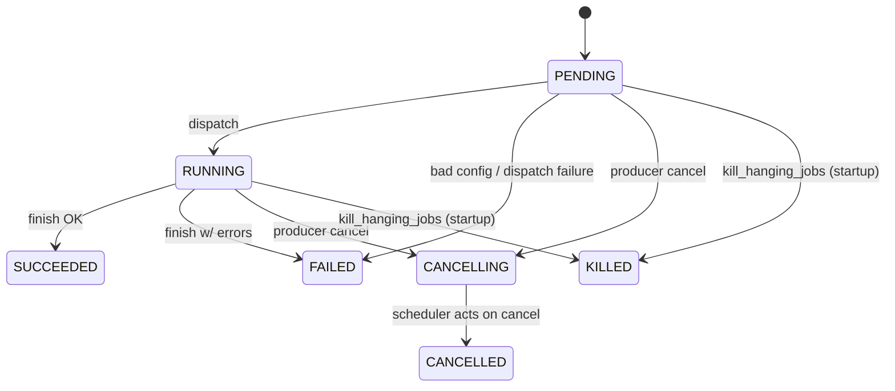

# Search Coordinator (Rust) — Design

Rewriting the Python **query scheduler**
(`components/job-orchestration/job_orchestration/scheduler/query/query_scheduler.py`)
as a Rust **search coordinator**. An existing framework can be referenced at
`components/compression-coordinator`, though search has more complexities (job
categorization, aggregation, decompression, cancellation).

Scope: the full orchestration lifecycle — concurrency/pool, poll loop, job
retirement/updates, sleep/wake cadence, query-table row reading, job
categorization, cancellation, aggregation (timeline + other), and
decompression. The current celery **reducer subsystem is deleted entirely** and
must not be carried over (see §7).

---

## Catalog

- [1. Background](#1-background)
    - [1.1 Tables and collections involved](#11-tables-and-collections-involved)
    - [1.2 Search query sources and the query jobs table](#12-search-query-sources-and-the-query-jobs-table)
    - [1.3 clp-s search output handlers](#13-clp-s-search-output-handlers)
    - [1.4 Source-to-output-handler mapping](#14-source-to-output-handler-mapping)
    - [1.5 Reducer (high-level)](#15-reducer-high-level)
- [2. Current state](#2-current-state)
    - [2.1 Job types and lifecycle](#21-job-types-and-lifecycle)
    - [2.2 Cancellation sources](#22-cancellation-sources)
    - [2.3 Webui's paired search + aggregation jobs over the same archives](#23-webuis-paired-search-aggregation-jobs-over-the-same-archives)
    - [2.4 Reducer wiring](#24-reducer-wiring)
- [3. Phased roadmap](#3-phased-roadmap)
- [4. MVP](#4-mvp)
    - [4.1 Features to support](#41-features-to-support)
    - [4.2 Limitations](#42-limitations)
    - [4.3 Features removed vs. the Python scheduler](#43-features-removed-vs-the-python-scheduler)
- [5. MVP+1 — Cancellation](#5-mvp1-cancellation)
    - [5.1 Features to support](#51-features-to-support)
    - [5.2 Support plan](#52-support-plan)
    - [5.3 Features removed vs. the Python scheduler](#53-features-removed-vs-the-python-scheduler)
- [6. MVP+2 — Timeline aggregation](#6-mvp2-timeline-aggregation)
    - [6.1 Features to support](#61-features-to-support)
    - [6.2 Support plan](#62-support-plan)
    - [6.3 Features removed vs. the Python scheduler](#63-features-removed-vs-the-python-scheduler)
- [7. MVP+3 — Decompression](#7-mvp3-decompression)
    - [7.1 Features to support](#71-features-to-support)
    - [7.2 Support plan](#72-support-plan)
    - [7.3 Features removed vs. the Python scheduler](#73-features-removed-vs-the-python-scheduler)
- [8. Misc](#8-misc)
- [9. Open questions](#9-open-questions)

---

## 1. Background

### 1.1 Tables and collections involved

Two storage tiers: a **control plane** (MySQL) the coordinator reads and writes,
and a **data plane** (MongoDB, the results cache) that clp-s workers write and
clients read.

**Control plane** (MySQL; created by `initialize-orchestration-db.py`):

- `QUERY_JOBS_TABLE_NAME` — one row per query job. Columns:
    - `id`
    - `type` (`QueryJobType`)
    - `status` (`QueryJobStatus`)
    - `creation_time`
    - `start_time`
    - `duration`
    - `num_tasks`
    - `num_tasks_completed`
    - `job_config` (`MEDIUMBLOB`, msgpack `SearchJobConfig`)
- `QUERY_TASKS_TABLE_NAME` — one row per archive-level task. Columns:
    - `id`
    - `job_id` (FK → `QUERY_JOBS_TABLE_NAME.id`)
    - `status` (`QueryTaskStatus`)
    - `archive_id`
    - `start_time`
    - `duration`

**Data plane** (MongoDB; `clp_config.results_cache`):

- One collection per query job, named by the job id. Contents:
    - matching records (plain search)
    - `{timestamp, count}` timeline documents (aggregation)
- `results_metadata_collection_name` (`clp_config.webui`) — per-search signal
  state, keyed by `searchJobId`.
- `stream_collection_name` — used by decompression jobs.

### 1.2 Search query sources and the query jobs table

| Source | Language | Submits | Mechanism |
|---|---|---|---|
| **webui server** | TS/Fastify | search **and** aggregation, as **two separate job rows** (`searchJobId` + `aggregationJobId`) | `QueryJobDbManager.submitJob` (msgpack via `@msgpack/msgpack`) |
| **api-server** | Rust | **search only** (`QueryConfig` has no `aggregation_config` field) | `client.submit_query` (sqlx) |
| **package `search.py`** | Python | search, **optionally with aggregation** (`aggregation_config` set when `--count` / `--count-by-time` passed) — **one job row** | `submit_query_job` |
| **package `decompress.py`** | Python | decompression only (`EXTRACT_IR` / `EXTRACT_JSON`) — not search | `submit_query_job` |

- **Search vs. aggregation**: both use `SEARCH_OR_AGGREGATION`. A job with
  `aggregation_config` set is an aggregation job; otherwise it is a plain search
  job.
- **Common job format**: all sources ultimately write the same row format to
  `QUERY_JOBS_TABLE_NAME`, with a msgpacked `SearchJobConfig`. The coordinator
  therefore processes jobs based on `type` and `aggregation_config`, regardless
  of source.
- **Different aggregation styles**: the webui submits search and aggregation as
  two separate job rows, while the package combines them into one row using
  `aggregation_config`. Aggregation goes through the reducer in either case.
- **Shared package helper**: `submit_query_job` in
  `clp_package_utils/scripts/native/utils.py` is shared by the package's
  `search.py` and `decompress.py`.
- **Cancellation**: the package only submits jobs and observes their status;
  cancellation is supported only by the webui server and the api-server.

### 1.3 clp-s search output handlers

A clp-s search worker (one per archive) writes its matches through one of five
**output handlers**, selected by the search config.

| Handler | subcommand | Class | What it does |
|---|---|---|---|
| **stdout** | `stdout` | `StandardOutputHandler` | writes `archive_id: log_event_idx: timestamp message` to stdout |
| **file** | `file` | `FileOutputHandler` | writes results to a file path; the worker then optionally uploads to S3 |
| **network** | `network` | `NetworkOutputHandler` | streams results over a TCP socket to `host:port` (`search_config.network_address`) |
| **results-cache** | `results-cache` | `ResultsCacheOutputHandler` | writes results as documents into a results-cache collection (`--uri`, `--collection <job_id>`) |
| **reducer** | `reducer` | `CountReducerOutputHandler` / `CountByTimeReducerOutputHandler` / `AggregationOutputHandler` | aggregation: streams **per-archive** aggregated results to the reducer process over a socket; sub-selected by `--count` / `--count-by-time` |

Selection logic in `fs_search_task` (the celery worker building the clp-s
command), in priority order:

1. `aggregation_config` set → **reducer** (with `--count` / `--count-by-time`).
2. else `network_address` set → **network**.
3. else `write_to_file` → **file**.
4. else → **results-cache**.

### 1.4 Source-to-output-handler mapping

Which handler a job selects follows from the fields each source sets on
`SearchJobConfig` (per the selection priority above).

| Source | stdout | file | network | results-cache | reducer |
|---|---|---|---|---|---|
| package `search.py` | — ¹ | — ² | ✓ | ✓ | ✓ |
| webui server | — | — | — | ✓ (search job) | ✓ (aggregation job) |
| api-server | — | ✓ ³ | — | ✓ ³ | — |

package `decompress.py` is not listed — decompression uses `clp-s x` (extract),
not a search output handler.

Footnotes:

1. package `search.py` stdout: terminal output is produced via the **network**
   handler — clp-s streams to a TCP server that `search.py` runs, which prints to
   its own stdout. The `stdout` handler is only reached when `clp-s search` is run
   directly from a terminal; no job-submitting source selects it.
2. package `search.py` file: `search.py` never sets `write_to_file`, so the `file`
   handler is never selected.
3. api-server: `file` vs `results-cache` is toggled by `buffer_results_in_mongodb`
   — `false` → `file`, `true` → `results-cache`.

### 1.5 Reducer (high-level)

The reducer is a standalone C++ process (`reducer-server`) that performs the
cross-archive **reduce** for aggregation jobs. clp-s search workers (one per
archive) do the **map** locally — bucketing matches (`CountByTimeOutputHandler`)
or counting (`CountReducerOutputHandler`) — and stream their per-archive partial
results to the reducer over a TCP socket. The reducer accumulates the sum in
memory (`CountOperator`) and upserts the combined `{timestamp, count}` timeline
to the per-job results-cache collection every `upsert_interval` (default 100 ms),
so the timeline fills in live as the job runs. On completion it does a final
publish and acknowledges the query scheduler.

- **Streaming reduce** — results are upserted incrementally, not summed in a
  batch at the end.
- **In-memory accumulator** — the hot working set stays off the results cache;
  only the compact combined timeline is written.
- **Completion handshake** — the reducer knows when all workers have flushed and
  signals the scheduler.

The reducer is spawned by a Python runner (`reducer.py`) with a configurable
concurrency of N `reducer-server` processes.

## 2. Current state

### 2.1 Job types and lifecycle

- `QueryJobType`: `SEARCH_OR_AGGREGATION`, `EXTRACT_IR`, `EXTRACT_JSON` (`job_orchestration/scheduler/constants.py`).
- `QueryJobStatus`: `PENDING`, `RUNNING`, `SUCCEEDED`, `FAILED`, `CANCELLING`, `CANCELLED`, `KILLED`.

- `CANCELLING` is written by producers (api-server/webui); every other transition is scheduler-written.
- Terminal states: `SUCCEEDED`, `FAILED`, `CANCELLED`, `KILLED`.
- The compression coordinator has no cancel action of its own — it is submit-and-poll-only, so `Killed` there is just a relabel of Spider's observed `Cancelled` terminal state ([job_handle.rs#L533](https://github.com/y-scope/clp/blob/fcfe3aee252fc8ac0ad5a0942ea029e65ac17f1d/components/compression-coordinator/src/job_handle.rs#L533)). The search side's `KILLED` is the `kill_hanging_jobs` startup-cleanup path — different semantics, same name. The `CANCELLED` state stays (it may remain useful once a real cancel path exists), but the `KILLED` renaming is unnecessary and will be removed from both coordinators.

The Python scheduler also has an in-memory `InternalJobState` with
`WAITING_FOR_REDUCER`, `WAITING_FOR_DISPATCH`, and `RUNNING`. These are scheduler execution phases,
not additional values in the durable `QueryJobStatus` lifecycle. For example, a SQL job can remain
`RUNNING` while its in-memory object alternates between `WAITING_FOR_DISPATCH` and `RUNNING` for
successive archive batches.

**Persistence restraint:** store the minimum status and supporting columns needed by external
consumers or fault-tolerant recovery. For the Spider path this includes durable facts such as the
CLP job status, `spider_id`, `dispatch_time`, `start_time`, and terminal diagnostics. A transient
phase such as "building the graph," "polling Spider," or "verifying the commit" should remain in
the job handle when it can be reconstructed after a restart from those durable facts. This avoids
unnecessary MySQL updates and row contention without sacrificing recovery. Add a status or column
when omitting it would make an acknowledged action ambiguous after a crash—for example, persisting
`spider_id` is necessary to reattach rather than submit duplicate work.

### 2.2 Cancellation sources

Cancellation is a DB write of `status=CANCELLING`; the coordinator polls it (today `fetch_cancelling_search_jobs`, filtered to `type=SEARCH_OR_AGGREGATION` — the cancel machinery is not wired for `EXTRACT_*`).

| Source | Route | Job id conveyed | What it cancels |
|---|---|---|---|
| **api-server** | `POST /query/{search_job_id}` | id in the **URL path** | one search job → `client.cancel_search_job(id)` |
| **webui server** | `POST /api/search/cancel` | ids in the **JSON body** `{searchJobId, aggregationJobId}` | both the search and aggregation job rows → `QueryJobDbManager.cancelJob` each |

- Both guard `status IN (PENDING, RUNNING)` — a terminal job cannot be cancelled.
- The webui additionally flips `results_metadata_collection_name` `lastSignal` to `RESP_DONE` so the client UI stops streaming.
- The package and mcp-server are submit-only; they do not cancel.
- Context only — the coordinator is source-agnostic: it just polls `status=CANCELLING` rows and acts, regardless of which source wrote the cancel.

### 2.3 Webui's paired search + aggregation jobs over the same archives

- The webui submits **two** `QUERY_JOBS_TABLE_NAME` rows per search: `searchJobId` (plain search → results) and `aggregationJobId` (timeline aggregation, `count_by_time_bucket_size` set).
- Both rows run over the **same set of archives**; the split is a webui UX concern (separate result streams for results vs. timeline), not a coordinator concept.
- The two are coupled client-side via `results_metadata_collection_name` (`searchResultsMetadataCollection`) and `updateSearchWhenJobsFinish` — the webui joins their completion to render the search page.
- To the coordinator these are two independent `SEARCH_OR_AGGREGATION` rows (one with `aggregation_config = None`, one with it set); it does not know they are paired.

### 2.4 Reducer wiring

- The reducer is a standalone C++ `reducer-server` process, spawned by a Python runner (`reducer.py`) with a configurable concurrency of N processes.
- Each clp-s search worker (one per archive) is the **map** side: it streams per-archive aggregated buckets to the reducer over a socket (`--host --port --job-id`).
- The reducer holds an in-memory `CountOperator` accumulator and upserts partial results to `results_metadata_collection_name` on a `PeriodicUpsertTask` cadence (`upsert_interval`, ~100ms).
- On completion, workers signal done; the reducer finalizes (`try_finalize_results`) and handshakes back via `ack_query_scheduler`; the combined `{timestamp, count}` timeline is written to the results cache.
- The coordinator does **not** run reduce logic — it only launches/wires the reducer (today via `reducer.py`). In the rewrite the reducer is deleted; the clp-s per-archive map stays, and the cross-archive reduce is done internally by the results cache (MongoDB), never by the coordinator.

---

## 3. Phased roadmap

| Phase | Scope | Notes |
|---|---|---|
| **MVP** | Plain **search** jobs only. No aggregation, no cancellation, no decompression. | Get search dispatch + job completion + DB updates working end-to-end through clp-s. |
| **MVP+1** | **Cancellation** | Dedicated background coroutine scanning `QUERY_JOBS_TABLE_NAME` for `status=CANCELLING` and submitting the cancellation to Spider; the job handle terminates when Spider reports the job cancelled. The api-server/webui already write these CANCELLING rows (§2.2), so the coordinator just polls the table — no new producer-facing API. |
| **MVP+2** | **Timeline aggregation** only | clp-s `--count-by-time` does per-archive bucketing (map); workers write the per-archive buckets to the results cache; the cross-archive sum (reduce) is done internally by MongoDB. No reducer process, and no aggregation logic in the coordinator. |
| **MVP+3** | **Decompression** (EXTRACT_IR / EXTRACT_JSON) | Decide celery-handoff vs Spider submission; resolve resource-group sharing. |
| **MVP+N** | **Other aggregations** | Require new Spider functionality (not ready). Blocked on Spider. |

---

## 4. MVP

### 4.1 Features to support

The structure mirrors the compression-coordinator (poll loop, two-phase fetch, semaphore-bounded concurrency, job-handle lifecycle, a TDL termination/commit task, status updates, and startup recovery).

**Query job status ownership** mirrors compression. The coordinator persists the Spider job id and transitions the CLP query job from `PENDING` to `RUNNING`. Each per-archive `search` TDL task runs clp-s, which writes results directly to MongoDB, and returns only the small completion payload needed by the graph. After all search tasks succeed, Spider runs `search::commit` as the graph's termination task. That TDL function executes on a Spider worker, uses the worker's `SpiderTaskExecutorConfig` plus DB credentials from its environment, reverse-looks up the CLP query job by `spider_id`, locks the row, and CAS-transitions it from `RUNNING` to `SUCCEEDED` with its duration. It does not read or modify the MongoDB results.

The coordinator continues polling Spider until the graph is terminal. On success it verifies that `search::commit` has already committed `SUCCEEDED`; it does not perform a second success write. If Spider fails or is unexpectedly cancelled before a successful commit, the coordinator records `FAILED` and a `status_msg`, while first preserving an already-committed `SUCCEEDED` result. This division makes successful publication atomic and idempotent in the worker-side commit transaction while retaining coordinator-side failure reporting and restart recovery.

The Rust job handle should follow the persistence restraint from §2.1. Its async control flow can
represent preparation, submission, Spider polling, and commit verification without adding those
phases to `QueryJobStatus` or writing them to MySQL. Persist additional state only when it closes a
real crash-recovery ambiguity.

MVP features:

- **Poll loop** — a `run` loop that sleeps on a configurable cadence and re-fetches jobs each tick, shutting down on a cancellation token.
- **Two-phase fetch** — re-dispatch `PENDING` rows already marked for dispatch, then fetch new `PENDING` rows up to the available concurrency permits.
- **Job categorization** — deserialize msgpack `job_config` and branch on `type` + `aggregation_config`; MVP accepts only `SEARCH_OR_AGGREGATION` with `aggregation_config = None` and leaves the rest for later phases (returned as unsupported).
- **Concurrency control** — a semaphore bounding in-flight jobs, with a permit owned by each job handle.
- **Dispatch** — submit a graph containing one `search` task per archive plus a `search::commit` termination task, persist the Spider job id, and mark the row `RUNNING` with `start_time`/`num_tasks`.
- **In-flight tracking** — poll Spider job state (idempotent start, exponential backoff) until terminal.
- **Job completion** — `search::commit` writes `SUCCEEDED` and `duration` transactionally after all search tasks succeed; on graph failure, the coordinator writes `FAILED` and `status_msg`. Results already sit in the results cache (per-job collection) written by clp-s; neither the coordinator nor the commit task touches them.
- **Startup recovery** — re-attach to `RUNNING` rows that already have a Spider job id, so a coordinator restart doesn't drop in-flight jobs.
- **Schema additions** — `QUERY_JOBS_TABLE_NAME` gains `status_msg`, `update_time`, `spider_id`, `dispatch_time` + indices, aligned with the compression jobs table.

### 4.2 Limitations

What MVP definitely does **not** support:

- **No aggregation** — `aggregation_config` must be absent; aggregation jobs are not handled (deferred to MVP+2 / Spider).
- **No cancellation** — `status=CANCELLING` rows are not scanned or acted on (deferred to MVP+1).
- **No decompression** — `EXTRACT_IR`/`EXTRACT_JSON` jobs are not handled (deferred to MVP+3).
- **No `QUERY_TASKS_TABLE_NAME` writes** — MVP does not write per-archive task rows; `num_tasks` is a placeholder and per-task progress (`num_tasks_completed`) is not tracked.
- **No reducer** — the reducer is not started, neither as a standalone service nor as part of the coordinator; aggregation is not handled in MVP (deferred to MVP+2, where the reduce is done by the results cache).
- **Results only to the results cache** — only the per-job results-cache collection is produced; the `network`, `file`, and `stdout` output handlers are not wired through the coordinator.
- **No `KILLED` state / `kill_hanging_jobs`** — orphaned jobs are recovered (re-attached) on restart, not killed.

### 4.3 Features removed vs. the Python scheduler

## 5. MVP+1 — Cancellation

- The actual search runs in Spider, not in the coordinator. The compression-coordinator's `CancellationToken` only cancels the **local job handle** (its poll loop), not the Spider job itself — so it is not sufficient for cancellation.
- A dedicated background coroutine scans `QUERY_JOBS_TABLE_NAME` for `status=CANCELLING` rows and submits a cancellation request to Spider for the corresponding Spider job.
- Once Spider cancels the job, the job handle's state polling observes the terminal `Cancelled` status and the handle terminates; the coordinator then records the job as `CANCELLED`.
- Cancel requests are already expressed as `status=CANCELLING` rows that the api-server/webui write to `QUERY_JOBS_TABLE_NAME` (§2.2); the coordinator only polls those rows, so it needs no new API or RPC with the producers.

### 5.1 Features to support

### 5.2 Support plan

### 5.3 Features removed vs. the Python scheduler

## 6. MVP+2 — Timeline aggregation

- The cross-archive reduce for timeline aggregation is done **internally inside the results cache (by MongoDB)**; clp-s only does the per-archive map (`--count-by-time` bucketing) and writes the per-archive buckets to the results cache. Aggregation is not done "natively in clp-s" — clp-s maps, the results cache reduces. Other aggregations go through Spider later and are not part of MVP+2.
- The celery reducer — `reducer_connection_queue`, `acquire_reducer_for_job`, `ReducerHandlerMessage*`, the reducer TCP server, `release_reducer_for_job`, the `reducer` subcommand in `fs_search_task` — is **not needed for the rewrite**, with no replacement in the coordinator. The reducer is never part of the coordinator, and the coordinator does not execute any search or aggregation logic — it only manages jobs and connects CLP services with Spider.
- The webui's separate aggregation-job row goes away: the webui submits a single row instead of the paired `searchJobId` + `aggregationJobId`. This is a webui-side change to track, not a coordinator concern.

### 6.1 Features to support

### 6.2 Support plan

### 6.3 Features removed vs. the Python scheduler

---

> **Legacy reference material below** — sections prefixed with `_` (`_2.3`, `_2.4`, `_4` Translation table, `_5`–`_7`) are retained from earlier drafts as context, not part of the new design.

---

### _2.3 Scheduler-side handling (Python, today)

- Poll loop: `handle_job_updates` calls `handle_cancelling_search_jobs` then `check_job_status_and_update_db` every `jobs_poll_delay`.
- Cancel: `cancel_job_except_reducer` (synchronous, atomic) revokes the celery `GroupResult`; `release_reducer_for_job` (async, called last) releases the reducer; then `QUERY_TASKS_TABLE_NAME` → `CANCELLED` and `QUERY_JOBS_TABLE_NAME` → `CANCELLED` (guarded by `prev_status=CANCELLING`).
- Retire: `check_job_status_and_update_db` polls each `RUNNING` job's rehydrated `GroupResult` and routes to `handle_finished_search_job` / `handle_finished_stream_extraction_job`.

### _2.4 clp-s search output handlers

**Scope:** everything in this subsection concerns the **clp-s binary's `search`
command** — its five output handlers (the *complete* set of user-facing output
destinations, registered at `CommandLineArguments.cpp:1023-1028` as the
`file`/`network`/`reducer`/`results-cache`/`stdout` subcommands) and, for each
§2.1 source, which of those handlers its submitted jobs can select. The five are
exhaustive for `clp-s search`; `VectorOutputHandler` and the `Aggregation*`
handlers are not CLI-selectable (aggregation is sub-selected within `reducer`).

Out of scope here: (a) **decompression** — `EXTRACT_*` jobs use the separate
`extract_stream` clp-s path, not a search output handler; and (b) **how a source
delivers results to its own client** — the webui reading Mongo, the api-server
streaming over HTTP, and `search.py` printing from its TCP server are
consumer-side mechanisms, not clp-s output handlers.

A clp-s search worker (one per archive) writes its matches through one of five
**output handlers**, selected by the search config. The handler names below are
the `cXxxOutputHandlerName` constants in
`components/core/src/clp_s/CommandLineArguments.cpp`; the classes are in
`components/core/src/clp_s/OutputHandlerImpl.hpp`.

| Handler | CLI name | Class | What it does | Used by |
|---|---|---|---|---|
| **stdout** | `stdout` | `StandardOutputHandler` | writes `archive_id: log_event_idx: timestamp message` to stdout | the `clp-s search` CLI default (terminal streaming); not used by the celery scheduler path |
| **file** | `file` | `FileOutputHandler` | writes results to a file path (`FileWriter::CreateForWriting`); the worker then optionally uploads to S3 | `search_config.write_to_file = true` (api-server `buffer_results_in_mongodb = false`) |
| **network** | `network` | `NetworkOutputHandler` | streams results over a TCP socket to `host:port` (`search_config.network_address`) | CLI `search.sh` / api-server live streaming to a client |
| **results-cache** | `results-cache` | `ResultsCacheOutputHandler` | writes results as documents into a MongoDB collection (`--uri`, `--collection <job_id>`, `--max-num-results`, optional `--dataset`) | the persistent results-cache path — webui reads collection `<job_id>`; scheduler's `found_max_num_latest_results` reads it for max-results short-circuit |
| **reducer** | `reducer` | `CountReducerOutputHandler` / `CountByTimeReducerOutputHandler` / `AggregationOutputHandler` | aggregation: streams **per-archive** aggregated results to the reducer process over a socket (`--host --port --job-id`). Sub-selected by `--count` (total count), `--count-by-time SIZE` (timeline buckets), or richer aggregation config | the aggregation jobs (webui `aggregationJobId`, CLI `--count`/`--count-by-time`) |

Selection logic in `fs_search_task` (the celery worker building the clp-s
command), in priority order:

1. `aggregation_config` is set → **reducer** (with `--count` / `--count-by-time`).
2. else `network_address` is set → **network**.
3. else `write_to_file` → **file**.
4. else → **results-cache**.

(`stdout` is the clp-s binary's own default when run from the CLI, not a path
the celery scheduler selects.)

### Which sources select which handler

Determined by which fields each source sets on `SearchJobConfig` (the selection
priority above). Verified from each source's config construction:

| Source | stdout | file | network | results-cache | reducer |
|---|---|---|---|---|---|
| CLI `search.py` | — ¹ | — ² | ✓ | ✓ | ✓ |
| webui server | — | — | — | ✓ (search job) | ✓ (aggregation job) |
| api-server | — | ✓ ³ | — | ✓ ³ | — |
| mcp-server | — | — | — | ✓ | — |
| CLI `decompress.py` | n/a (EXTRACT_* → `extract_stream`, not a search handler) |

Footnotes:

1. **CLI `search.py` stdout**: terminal output is produced via the **network** handler — clp-s streams results to a TCP server that `search.py` runs (`do_search_without_aggregation`), which prints to its own stdout. The clp-s `stdout` handler is only reached when the `clp-s search` binary is run directly from a terminal; no job-submitting source selects it.
2. **CLI `search.py` file**: `search.py` never sets `write_to_file` (its `--file-path` arg is an *input* file to search, not an output destination), so the `file` handler is never selected.
3. **api-server**: `file` vs `results-cache` is toggled by `buffer_results_in_mongodb` — `false` → `file`, `true` → `results-cache`.

Other notes:
- `network` is unique to the CLI `search.py` streaming path.
- `reducer` is reached only by sources that set `aggregation_config`: the webui (its aggregation job) and the CLI (`--count` / `--count-by-time`).
- `results-cache` is the common default and the only handler mcp-server ever uses.
- **S3 is a valid destination, not a separate handler.** The `file` handler's local output is uploaded to S3 when the worker's `stream_output.storage.type == S3` (and `write_to_file` and the task succeeded) — see `upload_results_to_s3` in `fs_search_task`, which writes to `{job_id}/{archive_id}`. So S3 is reachable via the `file` handler (e.g. api-server with `buffer_results_in_mongodb=false` on an S3-configured worker).

**Map-reduce note**: `reducer` is the **map** side — `CountByTimeReducerOutputHandler`
buckets matches per archive (`m_bucket_counts[bucket] += 1`) and flushes them to
the reducer over the socket. The reducer process (`CountOperator`) does the
**cross-archive sum** and writes the combined `{timestamp, count}` timeline to
Mongo. Deleting the reducer (§6) keeps the clp-s per-archive map; the
cross-archive reduce is done internally by MongoDB in the results cache (MVP+2)
— never by the coordinator.

---

## _4. Translation table (old → new)

The rewrite is a three-part project:

1. **search-coordinator** — polling, job categorization, and status-update logic. This is the focus of this section. A naive baseline exists on branch `search-coordinator/init` (`components/search-coordinator`).
2. **clp-tdl-package** — search task signatures, mirroring the existing compression tasks (out of scope for this doc).
3. **The bridge** — task-input construction and submission connecting 1 → 2 (out of scope for this doc).

### Part 1 baseline — branch `search-coordinator/init`

The branch reuses the structure of the **compression-coordinator**, already
Spider-based (this settles the old "Celery vs Rust worker" question: tasks go to
Spider). What it already has:

| Area | On the branch | Reference in compression-coordinator |
|---|---|---|
| Poll loop | `SearchCoordinator::run`: `select!` on `CancellationToken`; `saturating_sub` sleep; deferred `mark_jobs_dispatched` | `Coordinator::run` |
| Two-phase fetch | `fetch_new_job_rows`: first fetch = PENDING + `dispatch_time IS NOT NULL` (re-dispatch, no LIMIT); subsequent = PENDING + `dispatch_time IS NULL` `LIMIT available_permits()` | same function, same queries |
| Concurrency | `Semaphore(max_concurrent_jobs)`; owned permit moved into each spawned handle | `schedule_new_jobs` |
| Recovery | `fetch_submitted_running_jobs` (RUNNING + `spider_id IS NOT NULL`) → `QueryJobHandle::recover` per job | same (replaces Python `kill_hanging_jobs`) |
| Handle lifecycle | `QueryJobHandle::{run, recover, submit_and_wait, to_completion, report_failure}` | `job_handle.rs` |
| Status updates | `persist_spider_job_id` (→ RUNNING + `start_time` + `num_tasks` + COALESCE `dispatch_time`), `update_job_status`, `mark_job_failed` | same |
| Submitter | `QueryJobSubmitter` trait; `run_query_job_to_completion` (idempotent start + exponential-backoff job-state polling) implemented; `submit_query_job` is `todo!()` (parts 2–3) | submitter trait pattern |
| Schema | `QUERY_JOBS_TABLE_NAME` gains `status_msg`, `update_time`, `spider_id`, `dispatch_time` + matching indices — aligned with `compression_jobs` | `compression_jobs` columns |
| Config | `SearchCoordinator` config: `max_concurrent_jobs`, `job_polling_interval_millisecs`, `result_polling` backoff, task retries/timeouts, `resource_group` | `CompressionCoordinator` config |
| ID/status types | `QueryJobId = i32`; `QueryJobStatus` as a typed `sqlx::Type` enum | `CompressionJobId` / `CompressionJobStatus` |

### Part 1 gaps — what the branch does not do yet

The branch treats every `QUERY_JOBS_TABLE_NAME` row identically; **job categorization is
entirely absent** — this is the main new work relative to the compression side,
because `compression_jobs` has no `type` column, so the compression-coordinator
never needed to categorize:

- `fetch_new_job_rows` projects only `id` — it never reads `type`, `job_config`, or `creation_time`.
- `QueryJobHandle::new` is a stub: no msgpack deserialization of `job_config`, no `SearchJobConfig` / `ExtractIrJobConfig` / `ExtractJsonJobConfig` variants, no `aggregation_config` branch. Contrast with compression's `S3CompressionJobHandle::new`, which deserializes `ClpIoConfig`, rejects non-S3 inputs with `Error::UnsupportedInputConfig`, and derives the clp-s options — the same shape search needs, plus the `type` dispatch in front.
- The `UnsupportedInputConfig` skip path is carried over into `create_job_handle` (warn + leave the row for another handler) but nothing produces the error yet. It is the right hook for the phased rollout: aggregation (until MVP+2) and `EXTRACT_*` (until MVP+3) rows return it and stay with the legacy scheduler.
- `num_tasks` is a placeholder constant; no `QUERY_TASKS_TABLE_NAME` rows are written; `num_tasks_completed` and `duration` are never set.
- `update_job_status` has no previous-status CAS guard. Python guards with `set_job_or_task_status(prev_status=...)` (cancel-during-finish races), and compression's commit path CASes on `status = Running`; add the same guard.
- No CANCELLING scan, no per-job cancellation wiring (MVP+1).

Part-1 work on top of the baseline, in order: widen the fetch projection
(`type`, `job_config`, `creation_time`); categorize in `QueryJobHandle::new`
(`type` → config variant → `aggregation_config` branch), returning
`UnsupportedInputConfig` for not-yet-supported categories; write `QUERY_TASKS_TABLE_NAME`
rows and a real `num_tasks`; add the CAS guard on status transitions; then the
MVP+1 cancellation scan.

### MVP — plain search end-to-end (detailed)

The core path for a `SEARCH_OR_AGGREGATION` job with `aggregation_config = None`.
This is what MVP must implement.

| Step | Old (Python query scheduler) | New (Rust search coordinator) |
|---|---|---|
| Discover | `fetch_new_query_jobs`: `SELECT ... FROM QUERY_JOBS_TABLE_NAME WHERE status=PENDING` (MySQL control plane) | unchanged — poll `PENDING` rows from MySQL |
| Read row | `job_config` MEDIUMBLOB, **plain msgpack**; `msgpack.unpackb` → `SearchJobConfig` (Pydantic) | serde + `rmp-serde` (**plain msgpack, not Brotli**) → `SearchJobConfig` |
| Categorize | by `type` + `aggregation_config is None` → plain search | same; MVP handles only this branch |
| Plan work | `get_archives_for_search` / `_get_archives_for_search_without_datasets` resolve target archives; retention lower-bound from `creation_time` + `archive_retention_period` | same query logic in sqlx |
| Dispatch | `insert_query_tasks_into_db` (one `QUERY_TASKS_TABLE_NAME` row per archive); `celery.group(search.s(...) per archive).apply_async()`; `GroupResult.save()` | insert task rows; submit the search task graph to **Spider** via `QueryJobSubmitter::submit_query_job` (parts 2–3; `todo!()` on the branch); **no `GroupResult` rehydration** — the handle stays in-process |
| Execute | clp-s `search` celery task per archive; output handler = `results-cache` → writes matches to Mongo collection `<job_id>` | **data plane unchanged**: clp-s workers still use the `results-cache` handler → Mongo collection `<job_id>` |
| Retire | `check_job_status_and_update_db` polls the rehydrated `GroupResult`; `handle_finished_search_job` updates `QUERY_JOBS_TABLE_NAME`/`QUERY_TASKS_TABLE_NAME` | per-job handle: `to_completion` polls Spider job state with exponential backoff (implemented on the branch); updates `QUERY_JOBS_TABLE_NAME` (SUCCEEDED/FAILED) + `QUERY_TASKS_TABLE_NAME`; permit released on handle exit |
| Max-results short-circuit | `found_max_num_latest_results` reads Mongo `<job_id>` (sort by `timestamp` desc, limit) | unchanged — read Mongo `<job_id>` |
| `job_id` type | `str` everywhere (it's the Mongo collection name) | typed integer `JobId` internally; stringify only at the Mongo boundary |
| Concurrency | `ProcessPoolExecutor(scheduler_concurrency)` for blocking dispatch | `Semaphore(max_concurrent_jobs)`; `available_permits()` bounds the fetch `LIMIT` (see concurrency table below) |

Key MVP invariant: the **Mongo results cache (data plane) is untouched** — clp-s
workers still write to collection `<job_id>`, the webui still reads it. Only the
**MySQL control-plane orchestration** (discover/dispatch/retire/update) moves
from Python to Rust.

### Aggregation — timeline (detailed)

`SEARCH_OR_AGGREGATION` with `aggregation_config` set. Timeline = count / count-by-time.
This is a **map-reduce**; the reduce moves into the coordinator (MVP+2).

| Aspect | Old (Python + reducer) | New (Rust coordinator) |
|---|---|---|
| Config | `AggregationConfig {job_id, reducer_host, reducer_port, do_count_aggregation, count_by_time_bucket_size}` | keep `job_id`, `do_count_aggregation`, `count_by_time_bucket_size`; **drop `reducer_host` / `reducer_port`** |
| Job state | `WAITING_FOR_REDUCER` + `acquire_reducer_for_job` pulls a reducer from `reducer_connection_queue` | **deleted** — no reducer acquisition, no `WAITING_FOR_REDUCER` state |
| Per-archive **map** | clp-s `reducer` subcommand: `CountByTimeReducerOutputHandler` buckets matches per archive (`m_bucket_counts[bucket] += 1`) and streams them to the reducer over a socket | clp-s still does the per-archive bucketing; but instead of streaming to a reducer socket, **returns per-archive bucket counts to the coordinator** (open: via task result vs. a shared store) |
| Cross-archive **reduce** | reducer process `CountOperator` sums buckets across all archives and writes `{timestamp, count}` documents to Mongo collection `<aggregationJobId>` | **the coordinator accumulates** per-archive bucket counts and writes the combined `{timestamp, count}` timeline to Mongo — no separate reducer process |
| clp-s handler selection | `aggregation_config` set → `reducer` handler (priority 1 in `fs_search_task`) | MVP+2: clp-s emits per-archive buckets (map); transport changes so results return to the coordinator instead of a reducer socket |
| Finish handshake | `handle_finished_search_job` reducer `SUCCESS`/`FAILURE` handshake | **deleted** — the coordinator already has the per-archive results |
| `is_reducer_job` gating | special-cased in finish/cancel paths | **deleted** — no reducer-job distinction for timeline |
| webui two-row split | webui submits a separate `aggregationJobId` row and cancels both ids | webui-side change (track separately): collapse to a single search-job row whose clp-s run also emits the timeline |
| Other (non-timeline) aggregations | reducer (`AggregationOutputHandler`) | **MVP+N via Spider** (not ready); explicitly **not a port of the reducer** |

Open (§7): how clp-s workers return per-archive bucket counts to the
coordinator, and how the coordinator accumulates + writes the combined timeline.

### Concurrency, polling, retirement, sleep

| Old query scheduler (Python) | New search coordinator (Rust) |
|---|---|
| `ProcessPoolExecutor(scheduler_concurrency)` for blocking dispatch | tokio tasks; no process pool |
| `scheduler_concurrency` (pool size) | `Semaphore(max_concurrent_jobs)`; `available_permits()` bounds the pending-fetch `LIMIT` |
| `DispatchExecutor.dispatch_job_and_update_db` in a worker process | one `tokio::spawn`'d handle per job/batch |
| `GroupResult.save()` / `GroupResult.restore(id, app=app)` rehydration | eliminated — result handle stays in-process in the spawned task |
| `handle_updating_task` background retire loop + inline `handle_pending_query_jobs` | fold retire into the per-job task; keep only the outer poll loop |
| `handle_job_updates` cadence: `handle_cancelling_search_jobs` + `check_job_status_and_update_db` then `sleep(jobs_poll_delay - elapsed)` | outer `Coordinator::run`-style loop with `CancellationToken` via `select!`; sleep `job_polling_interval.saturating_sub(elapsed)` |
| `asyncio.wait(FIRST_COMPLETED)` on {update task, sleep, reducer tasks} | plain `loop { schedule_new_jobs(); sleep }`; no multi-task rendezvous |
| `sleep(jobs_poll_delay)` task paces next poll; reducer tasks are the wake signal otherwise | one cadence; per-job task awaits its own wake events within its own `select!` |
| `handle_pending_query_jobs` is a plain `def` called inline, blocking the event loop | dispatch is async I/O on the single runtime (or `spawn_blocking` if needed) |
| `active_jobs` module-global dict, no lock | per-task owned state; guarded container (`DashMap`/`Mutex`) only for cross-job views |
| `kill_hanging_jobs` on startup | resume-style recovery **implemented on the branch**: `fetch_submitted_running_jobs` → `QueryJobHandle::recover` (confirm against search semantics / duplicate-results caveat) |
| partial DB-failure handling: reads → empty, writes silently fail → state drift | propagate `Result`; define partial-failure semantics explicitly |
| archive batching via `num_archives_to_search_per_sub_job`, re-adding to `pending_search_jobs` next iteration | batching lives inside the per-job task looping over `remaining_archives` |
| `dispatch_time` written inline | `mark_jobs_dispatched` deferred until after the sleep, so the grant-of-permission write doesn't contend with submissions |
| first fetch re-dispatches prior-instance jobs (no LIMIT); later fetches `LIMIT available_permits` | reuse the compression-coordinator two-phase fetch pattern |

### Query-table row reading

| Old query scheduler (Python) | New search coordinator (Rust) |
|---|---|
| `fetch_new_query_jobs`: `SELECT id, job_config, type, creation_time FROM QUERY_JOBS_TABLE_NAME WHERE status=PENDING` | branch's `fetch_new_job_rows` projects only `id` — **widen to `type`, `job_config`, `creation_time`** (part-1 gap) |
| `fetch_cancelling_search_jobs`: `SELECT id FROM QUERY_JOBS_TABLE_NAME WHERE status=CANCELLING AND type=SEARCH_OR_AGGREGATION` | cancellation handled by a background scan coroutine (see §5) |
| `job_config` column = MEDIUMBLOB, **msgpack**-serialized; `msgpack.unpackb(...)` | deserialize with serde + msgpack (`rmp-serde`) — mirror the compression-coordinator's blob pattern (note: query uses plain msgpack, not Brotli-wrapped) |
| config validated into `SearchJobConfig` / `ExtractIrJobConfig` / `ExtractJsonJobConfig` (Pydantic) | equivalent Rust structs via serde; route by `type` before deserializing into the right variant |
| `creation_time` read as `job_creation_time` for archive-retention cutoff (`archive_retention_period`) | keep the retention lower-bound computation (`SECOND_TO_MILLISECOND * (creation_time - retention_period*MIN_TO_SECONDS)`) |
| `insert_query_tasks_into_db`: one `QUERY_TASKS_TABLE_NAME` row per archive; `lastrowid` → task_id | same; per-archive task rows, task id returned to the search handle |
| `set_job_or_task_status` branches on `QUERY_JOBS_TABLE_NAME` (id, quoted kwargs) vs `QUERY_TASKS_TABLE_NAME` (job_id, raw kwargs) | replace with typed sqlx queries per table; drop the stringly-typed branch |
| `SELECT id AS job_id` aliases column to dict key | keep SQL plain; use `#[sqlx(rename = "...")]` on the struct (centralizes the mapping) |

### Job categorization (by `QUERY_JOBS_TABLE_NAME.type`)

| `QueryJobType` value | Old handling | New handling |
|---|---|---|
| `SEARCH_OR_AGGREGATION`, `aggregation_config=None` | plain search via `search` celery task | **MVP**: the supported path; per-job task dispatches clp-s search batches |
| `SEARCH_OR_AGGREGATION`, `aggregation_config` set, `do_count_aggregation`/`count_by_time_bucket_size` | reducer subprocess (celery) | **MVP+2**: clp-s native timeline aggregation; no reducer |
| `SEARCH_OR_AGGREGATION`, other aggregation | reducer subprocess (celery) | **MVP+N**: Spider-backed; blocked on Spider; until then, leave for celery or mark unsupported |
| `EXTRACT_IR` | `extract_stream` celery task (IR extraction) | **MVP+3** (decompression); wave to celery until then |
| `EXTRACT_JSON` | `extract_stream` celery task (JSON extraction) | **MVP+3** (decompression); wave to celery until then |

Categorization point: read `type` first, then deserialize `job_config` into the
matching variant; within `SearchJobConfig`, branch on `aggregation_config`
presence and on whether it's timeline (count/count-by-time) vs other. This lives
in `QueryJobHandle::new` (currently a stub on the branch) — mirror
`S3CompressionJobHandle::new`, which validates `ClpIoConfig` and returns
`Error::UnsupportedInputConfig` for inputs it doesn't handle; the coordinator's
`create_job_handle` already warns-and-skips on that error, which is the rollout
mechanism for leaving aggregation/`EXTRACT_*` rows to the legacy scheduler until
their phase lands. Note the compression side never needed this: `compression_jobs`
has no `type` column — categorization is net-new for search.

### Decompression

| Old (Python) | New (Rust) |
|---|---|
| `EXTRACT_IR`/`EXTRACT_JSON` are **query jobs** in `QUERY_JOBS_TABLE_NAME`, submitted by `decompress.py` via `submit_query_job(type=EXTRACT_*)`, dispatched to celery `extract_stream` | **MVP+3**: not handled by the coordinator until then |
| decompression is **not** a search job (different `type`, different celery task) | same conceptual split; do not fold decompression into the search path |
| `IrExtractionHandle` / `JsonExtractionHandle` resolve the target archive/file-split and dedup concurrent extractions (`active_file_split_ir_extractions`, `active_archive_json_extractions`) | when ported: per-job handle + a guarded dedup map; defer until MVP+3 |
| stream-already-extracted / in-progress checks against the results cache (MongoDB `document_exists`) | when ported: same checks against the results cache |

**Spider considerations (big picture, MVP+3):**
- Are decompression jobs submitted to Spider as the **same task type** as search, or a **distinct type**? Recommend distinct (different resource profile).
- Do they **share the resource group** with search? Sharing = shared concurrency/scheduling budget; separating = independent scheduling and isolation. Decide with the Spider scheduling design; default to a **separate resource group** so decompression cannot starve search (and vice versa).

### Cancellation

| Old query scheduler (Python) | New search coordinator (Rust) |
|---|---|
| `fetch_cancelling_search_jobs` polled inside `handle_job_updates` every `jobs_poll_delay` | **MVP+1**: a background coroutine scans `QUERY_JOBS_TABLE_NAME` for `status=CANCELLING` on its own cadence (or shares the outer poll) |
| `cancel_job_except_reducer` revokes the Celery task; `release_reducer_for_job` sends a reducer FAILURE | per-job `CancellationToken`; abort the in-flight search; **no reducer release** |
| `WAITING_FOR_REDUCER` cancellation cancels `reducer_acquisition_task` | n/a (no reducer) |
| updates `QUERY_TASKS_TABLE_NAME` → `CANCELLED` (PENDING and RUNNING) and `QUERY_JOBS_TABLE_NAME` → `CANCELLED` (guarded by `prev_status=CANCELLING`) | same DB transitions via typed sqlx queries |
| `asyncio.sleep(0)` yield between jobs to avoid monopolizing the loop | `yield_now` / cooperative scheduling between cancellation batches |

**Long-term:** if the architecture moves to a **server (push) form**, the scan-based cancellation is replaced by event-driven cancel requests pushed to the coordinator. Design the per-job `CancellationToken` now so this swap is local.

### Telemetry

| Old query scheduler (Python) | New search coordinator (Rust) |
|---|---|
| `clp.query.active_jobs`, `clp.query.outstanding_tasks` (observable up-down counters, callbacks read `active_jobs`) | same metrics via `opentelemetry` + `opentelemetry-otlp` Rust crates; `ObservableUpDownCounter` callbacks |
| `clp.query.tasks.completed`, `clp.query.tasks.failed` (counters) | same |
| `clp.query.job.duration`, `clp.query.task.duration` (histograms, seconds) | same |
| `init_telemetry` / `shutdown_telemetry`; disabled via `CLP_DISABLE_TELEMETRY` / `DO_NOT_TRACK` | replicate the env-gate; OTLP export is language-agnostic, so dashboards are unchanged |

---

## _5. Cancellation design (MVP+1)

- One background coroutine (or a phase of the outer poll loop) scans `QUERY_JOBS_TABLE_NAME WHERE status=CANCELLING` at a fixed cadence.
- For each, look up the in-flight job handle; trigger its `CancellationToken`.
- The per-job task aborts the in-flight clp-s search, updates `QUERY_TASKS_TABLE_NAME` → `CANCELLED` (for PENDING and RUNNING) and `QUERY_JOBS_TABLE_NAME` → `CANCELLED` (guarded by `prev_status=CANCELLING`), and releases its semaphore permit.
- Keep a per-job `CancellationToken` from MVP so the long-term swap to push-based (server-form) cancellation is local — only the trigger source changes.
- Consumes the same `CANCELLING` rows the api-server and webui already write (§2.2); no producer-side coordination.

---

## _6. Reducer deletion (explicit)

Delete (do **not** carry over) all of:

- `reducer_connection_queue` and the `asyncio.start_server` reducer TCP server
- `handle_reducer_connection`
- `ReducerHandlerMessage` / `ReducerHandlerMessageQueues` / `ReducerHandlerMessageType`
- `acquire_reducer_for_job` / `release_reducer_for_job`
- the reducer branches of `cancel_job_except_reducer`
- the `WAITING_FOR_REDUCER` job state
- the `reducer` subcommand construction in `fs_search_task`
- the reducer handshake in `handle_finished_search_job`
- the reducer process itself (`CountOperator` and friends)

The reducer's role is **not** absorbed by the coordinator. The coordinator never
executes search or aggregation logic — it only manages jobs and connects CLP
services with Spider. Timeline aggregation instead works as: clp-s does the
per-archive map (`--count-by-time` bucket counts), workers write those
per-archive buckets to the **results cache**, and the cross-archive reduce
(summing buckets into one `{timestamp, count}` timeline) is done **internally by
MongoDB** over those documents. Other aggregations are a future Spider-backed
path (MVP+N), not a reimplementation of the reducer. The webui's separate
`aggregationJobId` (§2.2) is part of the reducer-era design and is dropped
alongside it.

---

## _7. Open questions

- **Retire model** *(settled on branch `search-coordinator/init`)*: per-handle self-retirement — `QueryJobHandle::to_completion` polls Spider job state inside the spawned task.
- **Result backend** *(settled)*: tasks are submitted to **Spider**, not Celery — `QueryJobSubmitter` polls Spider job state; no `GroupResult`-style handles.
- **Cross-job shared state**: container choice (`DashMap` vs. `Mutex`) for dedup/metrics; confirm what must be visible across jobs.
- **Decompression + Spider**: same task type as search or distinct; shared vs. separate resource group (default: separate). Resolve at MVP+3 with Spider scheduling design.
- **Other aggregations (MVP+N)**: Spider API surface and scheduling, not yet ready.
- **Partial DB-failure semantics**: define explicitly; no silent swallowing (the known Python limitation).
- **Timeline aggregation wiring**: clp-s `--count-by-time` already does per-archive bucketing (map); the coordinator must take over the cross-archive sum (reduce) the reducer used to do. Open: how each clp-s worker returns its per-archive bucket counts to the coordinator (task result vs. shared store), and how the coordinator accumulates + writes the combined `{timestamp, count}` timeline to the results cache.
- **webui aggregation-job removal**: the webui currently submits/cancels a separate aggregation job row; collapsing it to a single search-job id is a webui-side change to track when the reducer is deleted.
